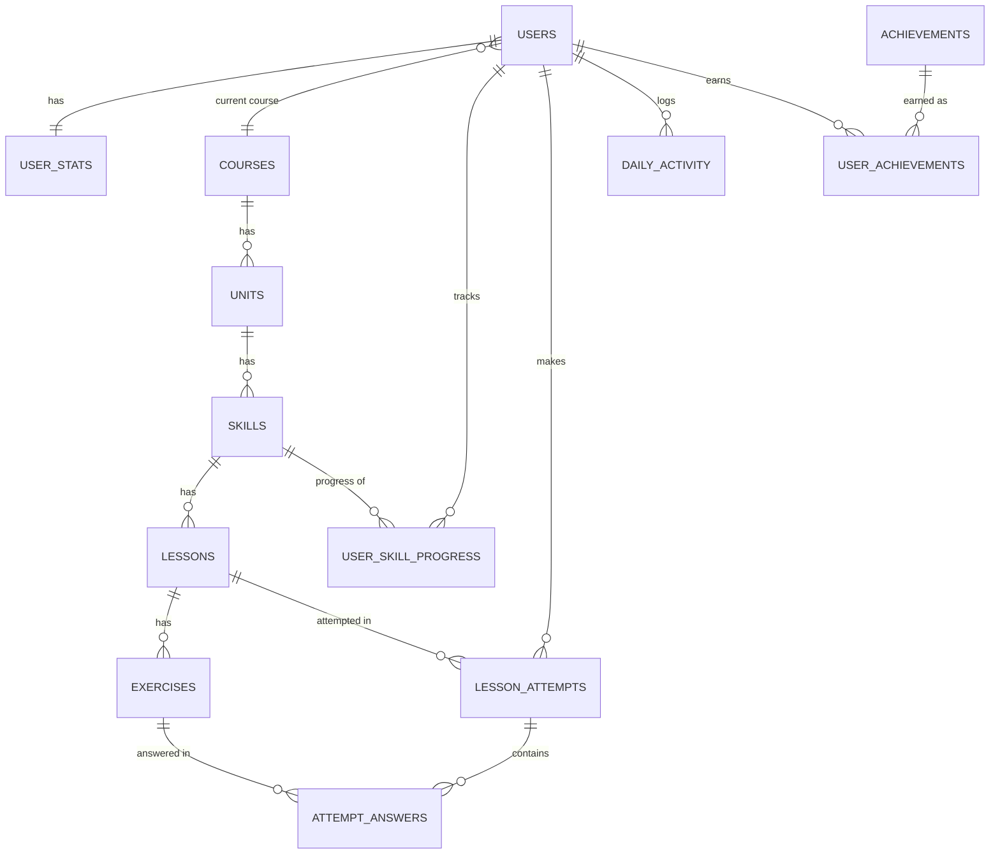
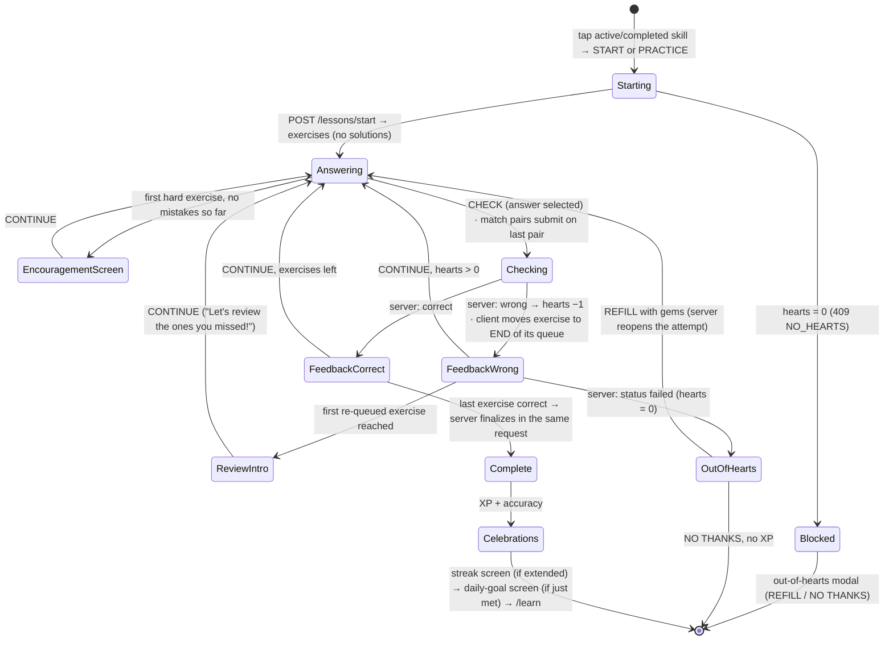

# lingoleap: a Duolingo-style language-learning app

A full-stack Spanish-for-English-speakers course: a zig-zag learning path, a five-type lesson player, and XP, hearts, streaks, a daily goal, achievements and a weekly leaderboard. The **server owns every number** and the frontend only renders it.

| | |
|---|---|
| **Live demo** | <!-- TODO: paste demo URL --> |
| **API docs (Swagger)** | <!-- TODO: paste API URL -->`/docs` (locally: http://localhost:8000/docs) |
| **Demo GIF** | <!-- TODO: hero GIF of a full lesson: start → 8 exercises → complete → streak screen --> |

> Original mascot, icons and wordmark throughout. No Duolingo owl, logo, illustrations or font files (the font is Nunito via `next/font`).

**Contents:** [Features](#features) · [Tech stack](#tech-stack) · [Architecture](#architecture) · [Project structure](#project-structure) · [Database schema](#database-schema) · [Lesson engine](#lesson-engine) · [Gamification rules](#gamification-rules) · [API overview](#api-overview) · [Setup](#setup-instructions) · [Environment variables](#environment-variables) · [Seed data](#seed-data) · [Testing the day logic](#testing-the-day-logic) · [Assumptions](#assumptions) · [Deployment](#deployment) · [Screenshots](#screenshots) · [Limitations](#known-limitations--future-work)

---

## Features

### Brief's must-haves

| Area | Requirement | Status |
|---|---|---|
| **Learning path** | Visual path of units and skills (3 units × 4 skills) | ✅ |
| | Locked / active / completed states with lock-unlock progression | ✅ derived, never stored |
| | Progress ring per skill | ✅ on the active node (lessons done ÷ total); completed nodes turn gold with a check |
| | Top bar: streak, XP, hearts, mocked gems | ✅ |
| **Lesson player** | Lesson = ordered sequence of exercises, with a progress bar | ✅ 8 per lesson |
| | 5 types: multiple choice · translate (word bank) · match pairs · fill in the blank · type the answer | ✅ |
| | Immediate correct/incorrect feedback with a sliding feedback footer | ✅ |
| | Lose a heart per wrong answer; 0 hearts handled | ✅ out-of-hearts modal with gem refill |
| | XP and skill progress awarded on completion | ✅ one transaction, idempotent |
| **Gamification** | Streak increments on daily activity; day logic testable | ✅ Settings → Developer tools → Advance day (local only) |
| | XP totals, daily-goal indicator | ✅ |
| | Hearts regenerate over time, or via mocked refill / practice | ✅ lazy regen + 350-gem refill + practice heart |
| | Leaderboard (seeded allowed) | ✅ real weekly XP across 15 seeded learners |
| | Everything persists per user | ✅ SQLite |
| **Profile** | Streak, total XP, achievements | ✅ plus 7-day XP chart |
| **Content** | Units/skills/lessons/exercises stored in DB and seeded | ✅ 288 exercises, generated |
| **Experience** | Colourful UI with mascot flourishes, animated feedback, modals/toasts/celebrations | ✅ |
| | Settings placeholder | ✅ real settings (display name, theme, daily goal, dev tools) |

### Bonus implemented

- Dark mode: Light/Dark toggle in Settings, no flash on load
- Responsive layout: 3-column desktop, icon-only sidebar on tablet, top stats bar + bottom tab bar on mobile
- Achievements system: 5 badges, each measuring a stat, with server-side progress toward its threshold
- Leaderboard computed from real activity rows across 15 learners, not hard-coded ranks
- Typo/accent-tolerant typed answers ("Pay attention to the accents." / "You have a typo.")
- Animations: tile fly between word bank and answer line, feedback footer slide, heart shake, card pulse/shake, confetti, "N IN A ROW" combo flag
- Keyboard play: Enter to check/continue, number keys on choices and match pairs
- Race-safe finalize and quit (conditional `UPDATE`, covered by tests)

Not implemented (see [limitations](#known-limitations--future-work)): audio/TTS, timed or legendary mode.

### Pages that exist in `frontend/src/app/`

| Route | State |
|---|---|
| `/learn` (`/` redirects here) | Built: path, unit banners, node popover, stats bar, rail cards |
| `/lesson/[attemptId]` | Built: full-screen player, review/encouragement screens, completion → streak → daily-goal sequence |
| `/leaderboard` | Built |
| `/profile` | Built |
| `/settings` | Built: display name, theme, daily goal, developer tools |
| `/quests`, `/shop` | **Coming Soon** placeholders (allowed by the brief). `/friends` is not built and nothing links to it |

Other placeholders: the GUIDEBOOK button (shows a "Coming soon!" toast), real authentication, speech exercises, a second language.

---

## Tech stack

| Layer | Choice | Why |
|---|---|---|
| API | **FastAPI** (not Django) | The app is a JSON API for a Next.js client, so Django's templates, admin and forms add nothing. Pydantic discriminated unions validate the five exercise shapes, and `/docs` is auto-generated. |
| ORM | **SQLAlchemy 2.0** (`Mapped[]`) | Typed models with explicit relationships and constraints. |
| Validation / config | **Pydantic v2**, **pydantic-settings** | Typed request/response models for every endpoint; env config in one class. |
| Database | **SQLite** (`backend/data/app.db`) | Required by the brief; zero setup. Schema created with `create_all`, populated by a seeder. |
| Tests / lint | **pytest + httpx**, **ruff** | Service and API tests; one lint config. |
| Frontend | **Next.js 16** (App Router) + **TypeScript** (strict) | Required stack. |
| Styling | **Tailwind CSS** v4, design tokens in `tailwind.config.ts` + CSS variables | Pixel-matching with no hex codes in components; the same variables power dark mode. |
| Server state | **TanStack Query** | Read-only mirror of server values; caches are patched from mutation responses. |
| Animation | **Framer Motion** | Feedback slide, tile `layoutId` fly, shakes, modals. |
| Celebration | **canvas-confetti** | Lesson-complete burst. |
| Font | **Nunito** via `next/font` | Closest free match to a rounded bold UI face. |

No Redux/Zustand (React Query plus one `useReducer` covers it), no component kit, no icon pack (inline SVG icons), no Alembic, Celery, Redis, JWT or Docker.

---

## Architecture

```
Browser (Next.js, React Query, lessonReducer)
   │  REST + JSON under /api   (all fetches go through lib/api.ts)
   ▼
Routers  (backend/app/api)        parse request → call ONE service function → return a schema
   ▼
Services (backend/app/services)   every business rule: grading, hearts, streak, XP, unlocks, achievements; own the transaction
   ▼
Models   (backend/app/models)     SQLAlchemy Mapped[] + FK / CHECK / UNIQUE constraints
   ▼
SQLite   (PRAGMA foreign_keys=ON on every connection)
```

| Layer | Owns | Never does |
|---|---|---|
| Frontend | Rendering, animation, the lesson UI state machine, local answer selection, routing | Computes XP, hearts, streak or unlocks; grades answers |
| Routers | HTTP shape and status codes | Business rules, queries |
| Services | All rules and transactions | HTTP concerns |
| Models / DB | Persistence and constraints | Derived state (locked/active is computed) |

### The rule: the server owns every number

- XP, hearts, gems, streak, progress, unlocks and answer grading are computed on the server. The client renders `response.hearts`, `result.xp_earned` and so on, with **no `hearts - 1` anywhere** and no optimistic updates for gamified values.
- Exercise solutions live in a separate `solution` column and are **never sent to the client**.
- **One clock.** `services/clock.py` is the only place that reads the system time (learner timezone + the simulated day offset). Streaks, heart regen, daily goal and the leaderboard week all read it, so advancing the day moves everything together.
- **Lazy rules.** Heart regeneration and streak expiry are applied when data is read (`GET /api/me`), so no background job is needed.
- **Errors** are always `{"error": {"code", "message"}}`, including validation failures (`VALIDATION_ERROR`, 422).

### Default-user dependency

There is no login. `get_current_user()` (`backend/app/deps.py`) is a FastAPI dependency that returns the user whose id is `DEFAULT_USER_ID` (1, the seeded learner "Alex Morgan"). Every route takes `user: CurrentUser`, so adding real auth later means changing that one function. There is no `X-User-Id` header.

---

## Project structure

The tree below is read from the repository, not predicted.

```
.
├── CLAUDE.md                     project rules for the AI pair-programmer
├── docs/                         plan.md (original plan) · deviations.md (what shipped differently)
├── reference/                    reference screenshots used for the visual pass (gitignored)
├── backend/
│   ├── app/
│   │   ├── main.py               app factory, CORS, lifespan (startup safeguard), router registration
│   │   ├── config.py             pydantic-settings
│   │   ├── db.py                 engine, SessionLocal, PRAGMA foreign_keys=ON
│   │   ├── deps.py               get_db, get_current_user
│   │   ├── errors.py             AppError + the two exception handlers
│   │   ├── models/               base.py · content.py · learner.py · history.py   (14 tables)
│   │   ├── schemas/              me · path · lesson · exercises (discriminated union) · leaderboard · attempt_result · dev · health
│   │   ├── services/             clock · hearts · streak · path · grading · lesson_engine · achievements · leaderboard · profile · dev_tools
│   │   ├── api/                  me · path · lessons · hearts · leaderboard · dev · health
│   │   └── seed/                 content/ (structures.py + unit_1..3.py) · generator.py · attempt_history.py · run.py · startup.py
│   ├── tests/                    test_api · test_grading · test_hearts_and_streak · test_lesson_engine · test_schema · test_seed · test_startup
│   ├── data/                     app.db (gitignored)
│   ├── requirements.txt · pyproject.toml (ruff config)
│   └── .env.example
└── frontend/
    ├── src/app/
    │   ├── (main)/               layout.tsx (sidebar + rail shell) · learn · leaderboard · profile · settings · quests · shop
    │   ├── lesson/[attemptId]/   full-screen player, no shell
    │   └── layout.tsx · providers.tsx · page.tsx (redirects to /learn)
    ├── src/components/
    │   ├── ui/                   Button · Card · Modal · ProgressBar · Toast · Skeleton · Avatar · Dropdown · Icon
    │   ├── layout/               Sidebar · RightRail · MobileTopBar · MobileTabBar · NavItem
    │   ├── path/                 UnitHeader · PathColumn · SkillNode · ProgressRing · NodePopover · LockedTooltip …
    │   ├── lesson/               LessonPlayer · useLessonPlayer · header/footer/feedback · celebration screens
    │   ├── lesson/exercises/     5 exercise components + registry.ts (EXERCISE_REGISTRY)
    │   ├── gamification/         StatsBar · Streak/Hearts/Gems/Xp badges · panels · countdown
    │   ├── profile/ · leaderboard/ · rail/ · settings/ · mascot/
    └── src/lib/                  api.ts · types.ts · queries.ts · lessonReducer.ts · theme.ts · …
```

### Where the build diverges from the plan's predicted tree

| Plan said | What exists |
|---|---|
| `models/` split `user.py, course.py, progress.py, gamification.py` | `base.py, content.py, learner.py, history.py` |
| Services: clock, hearts, streak, path, lesson_engine, grading, achievements, leaderboard | Plus **`profile.py`** (`/me`, profile, settings, heart actions) and **`dev_tools.py`**, because routers may not hold logic |
| `seed/content.py` | `seed/content/` package (`structures.py` + one file per unit); plus `attempt_history.py` and **`startup.py`** (startup safeguard) |
| Answer union `AnswerSubmission` | None. One answer model per type; `grading.py` picks it from the exercise's stored type, so the client never sends a type |
| `errors` inside another module | Dedicated `errors.py` |
| `/friends` placeholder | Not built |
| `docs/` schema diagram and screenshots | Diagram lives in this README; screenshots are pending |
| `repositories/` | Not created (queries stay in services) |

Every deviation is logged in [`docs/deviations.md`](docs/deviations.md).

---

## Database schema

14 tables in three groups: **content** (course → unit → skill → lesson → exercise), **learner state**, and **lesson history**. Lock/unlock state is derived, never stored, so it cannot drift.



(`app_settings` is a standalone key/value table, so it has no edges.)

### Content tables

| Table | Fields | Keys & constraints |
|---|---|---|
| `courses` | id, code, title, learning_language, from_language | PK id · UNIQUE code |
| `units` | id, course_id, position, title, description, color | FK course_id → courses CASCADE · UNIQUE(course_id, position) |
| `skills` | id, unit_id, position, title, icon | FK unit_id → units CASCADE · UNIQUE(unit_id, position) |
| `lessons` | id, skill_id, position, xp_reward (default 10) | FK skill_id → skills CASCADE · UNIQUE(skill_id, position) · CHECK xp_reward > 0 |
| `exercises` | id, lesson_id, position, type, prompt, **payload JSON**, **solution JSON** | FK lesson_id → lessons CASCADE · UNIQUE(lesson_id, position) · CHECK type IN (the 5 types) |

### Learner-state tables

| Table | Fields | Keys & constraints |
|---|---|---|
| `users` | id, username, display_name, avatar_color, timezone (default `Asia/Kolkata`), daily_goal_xp (default 20), current_course_id, created_at | UNIQUE username · FK current_course_id → courses · CHECK daily_goal_xp IN (10, 20, 30, 50) |
| `user_stats` | user_id, total_xp, gems, hearts, hearts_updated_at, current_streak, longest_streak, last_active_date | PK + FK user_id → users CASCADE (1:1) · CHECK hearts BETWEEN 0 AND 5 · CHECK total_xp, gems, streaks ≥ 0 |
| `user_skill_progress` | user_id, skill_id, lessons_completed, completed_at, updated_at | composite PK(user_id, skill_id) · FKs CASCADE · CHECK lessons_completed ≥ 0 |
| `daily_activity` | user_id, activity_date, xp_earned, lessons_completed | composite PK(user_id, activity_date) · FK CASCADE |
| `achievements` | id, code, title, description, icon, metric, threshold | UNIQUE code · CHECK metric IN (total_xp, streak, lessons, skills, perfect_lessons) |
| `user_achievements` | user_id, achievement_id, unlocked_at | composite PK · FKs CASCADE |
| `app_settings` | key, value | PK key. Holds `day_offset` for the simulated clock |

### Lesson-history tables

| Table | Fields | Keys & constraints |
|---|---|---|
| `lesson_attempts` | id, user_id, lesson_id, mode, status, mistakes, xp_earned, started_at, finished_at, **result JSON** | FKs → users, lessons · CHECK mode IN (learn, practice) · CHECK status IN (in_progress, completed, failed, abandoned) · INDEX(user_id, status) |
| `attempt_answers` | id, attempt_id, exercise_id, submitted JSON, is_correct, answered_at | FK attempt_id → lesson_attempts CASCADE · FK exercise_id → exercises · INDEX(attempt_id) |

`lesson_attempts.result` is the stored finalize outcome. It is what makes a retried completing answer return the original result instead of recomputing it from changed state.

### Five design decisions

1. **Exercise `payload` / `solution` as JSON columns.** The five types have different shapes and nothing queries inside them; five subtype tables would add joins for no benefit. Integrity comes from Pydantic discriminated unions, validated at seed time and on read. `solution` is separate from `payload` so answers cannot be serialized to the client by accident.
2. **`user_stats` split from `users`.** Identity rarely changes; counters change every lesson. It keeps the 1:1 explicit and the hot row small.
3. **`total_xp` is a deliberate denormalization** of `SUM(daily_activity.xp_earned)`, updated in the same transaction as the activity row. Reads are O(1), and `daily_activity` stays the audit trail and powers weekly XP. The seeder computes totals from history, and a test asserts they agree.
4. **Locked / active / completed is computed** from `user_skill_progress` plus the (unit, skill) ordering (`services/path.py`). Storing it would create a second source of truth.
5. **SQLite enforces foreign keys only with `PRAGMA foreign_keys=ON`**, set per connection in a `connect` event listener in `db.py`; `test_schema.py` proves bad FKs and bad enum values are rejected.

---

## Lesson engine

One registry on each side keeps the five types cheap: the backend maps `type → grader` (`GRADERS` in `grading.py`), the frontend maps `type → component` (`EXERCISE_REGISTRY`). `LessonPlayer` never branches on exercise type, and `grading.py` is the only backend module that knows the types exist.

### Flow

This is the flow as built. **The server keeps no queue**: the client re-queues wrong exercises (see notes below the diagram).



**What differs from the original plan** (all in [`deviations.md`](docs/deviations.md), Phase 6):

- **Re-queueing is client-side.** The server accepts exercises in any order, rejects only re-answering one that is already correct (`EXERCISE_ALREADY_CORRECT`), and finalizes once every exercise has a correct answer. After a refresh the client rebuilds its queue from the server's answer log: unanswered exercises in lesson order, then ones answered wrong and not yet right.
- **SKIP is hidden.** The plan had SKIP send a wrong answer, but there is no skip endpoint, and a made-up submission would store an answer the learner never made.
- **No `HYDRATE` action.** The reducer is built once from the attempt (`createInitialState`). Extra actions: `CHECK_ERROR` (network error, answer kept), `LESSON_CLOSED` (attempt closed elsewhere, e.g. another tab) and `REFILLED`.
- **Extra screens:** the "review the ones you missed" intro, and a "Let's make this a bit harder…" screen before the first hard exercise (type-the-answer counts as hard).
- **Lesson-complete screen shows 2 stat cards** (Total XP, Accuracy), not three.
- **Progress bar** = correct exercises ÷ total, so a wrong answer never moves it.
- **Start-to-resume:** the lesson page calls `GET /api/attempts/{id}`, which works for both a fresh start and a refresh.

### Exercise types

| `type` | UI | `payload` (sent to client) | `solution` (server only) | Grader rule |
|---|---|---|---|---|
| `multiple_choice` | 3–4 text-only option cards, keys 1–4 | `{options: [{id, text}]}` | `{option_id}` | Exact id match |
| `translate` | Source sentence + word-bank tiles, tiles fly between bank and answer line | `{source_text, tiles: [{id, text}]}` (correct words + distractors) | `{accepted: [[word, …], …]}` | Submitted tile texts, case-insensitive, equal one accepted sequence |
| `match_pairs` | Two columns, tap to pair; auto-submits on the last pair, **no CHECK button** | `{left: [{id, text, pair}], right: […]}` | `{}` | Server re-checks every pair and that all left items are matched. **Never costs a heart** |
| `fill_blank` | Sentence with a gap, 4 options | `{before, after, options: […]}` | `{accepted: [word]}` | Normalized match |
| `type_answer` | Free-text input, marked HARD | `{source_text, input_language}` | `{accepted: [text, …]}` | Normalize (lowercase, trim, collapse spaces, strip `.,!?¿¡`). Accent-only difference → correct + "Pay attention to the accents." Levenshtein ≤ 1 on answers of 5+ letters → correct + "You have a typo." |

No emoji appear in exercises (multiple-choice options are text only), so a "yes/no" card can never look like feedback before CHECK.

### Finalize: one transaction, inside the answer call that completes the lesson

1. **Claim the attempt** with one conditional `UPDATE lesson_attempts SET status='completed' WHERE id=? AND status='in_progress'`. Of two simultaneous completing requests only one changes a row. The loser rolls back its writes and returns the stored result, exactly like a retry.
2. `xp = lesson.xp_reward (10) + 5 if mistakes == 0`. Set `attempt.xp_earned`, `finished_at`, and add to `user_stats.total_xp`.
3. Upsert `daily_activity(user, today)`: `xp_earned += xp`, `lessons_completed += 1`.
4. Streak service: extend / keep / restart; update `longest_streak`.
5. If `mode = learn`: `user_skill_progress.lessons_completed += 1`, set `completed_at` when it equals the skill's lesson count. **Practice mode awards XP but never moves progress.**
6. Achievements service: insert every newly crossed threshold.
7. Build and store `result` on the attempt, then return it:
   `{xp_earned, accuracy, mistakes, duration_s, streak:{count, extended}, daily_goal:{today_xp, goal_xp, just_met}, skill_completed, achievements_unlocked[]}`.

**Idempotent:** an answer on an already-`completed` attempt returns the stored `result` and awards nothing. Evidence: `test_simultaneous_completing_answers_award_once` reproduces the race with two database sessions (timing-independent), and `test_quit_racing_a_completion_leaves_the_attempt_completed` covers the quit race. Quit uses the same conditional-`UPDATE` guard.

---

## Gamification rules

| Mechanic | Rule (as implemented) |
|---|---|
| **XP** | 10 per lesson, **15 if no mistakes**. Added to `total_xp`, today's `daily_activity` and the leaderboard in one transaction. Practice replays also earn XP. |
| **Accuracy** | `round(100 × exercises ÷ (exercises + mistakes))`, shown on the complete screen. A flawless lesson is 100. |
| **Heart loss** | Each wrong answer costs 1 heart, except **match pairs, which never cost a heart**. The first loss from a full set starts the regen countdown. Quitting keeps hearts already lost. |
| **0 hearts** | The attempt becomes `failed`, no XP is awarded, and starting another lesson returns `409 NO_HEARTS` (the UI opens the out-of-hearts modal). |
| **Heart regen** | Lazy, computed on read: `floor(elapsed ÷ HEART_REGEN_MINUTES)` hearts, capped at 5. The timer advances by whole intervals only, so partial progress is kept. **Demo interval: 30 min** (a real app uses hours). `/api/me` returns both `next_heart_at` and `seconds_until_next_heart` (rounded up); the browser counts down from the latter because `next_heart_at` is learner-local wall time and cannot be compared with the browser clock. |
| **Refill** | 350 gems for a full set (gems are mocked), and it reopens the attempt that failed. `NOT_ENOUGH_GEMS` (409) if short; `HEARTS_FULL` (409) if already full, so gems are never wasted. |
| **Practice for a heart** | `POST /api/hearts/practice` grants one free heart (mock), capped at 5. Offered in the top-bar hearts panel only; it does not reopen a failed attempt. |
| **Streak: extend** | First finished lesson of a day when the last active day was *yesterday*: `+1`. |
| **Streak: keep** | Further lessons the same day change nothing (`extended: false`, so the streak screen shows only once per day). |
| **Streak: reset** | Last active day older than yesterday: the streak reads **0** on the next read, and the next lesson sets it to 1. A streak survives until the end of the day after the last active day. `longest_streak` is a kept record. |
| **Daily goal** | `users.daily_goal_xp` (10 / 20 / 30 / 50, default 20) vs today's `daily_activity.xp_earned`. `just_met` is true only on the lesson that crosses the goal, which triggers the goal screen once. |
| **Leaderboard week** | Monday–Sunday, from `daily_activity` (via `clock.week_start`). The week filter sits in the `LEFT JOIN`, so learners with 0 XP still appear. Ties break alphabetically by display name. |
| **Profile chart** | The **last 7 days ending today** (`week_xp`), deliberately not the Monday–Sunday leaderboard week. |
| **Skill unlock** | Walk skills in (unit, skill) order: the first with `lessons_completed < lesson_count` is active, earlier ones completed, later ones locked. A unit is locked when its first skill is locked. |

### Achievements (five, computed from existing stats)

| Code | Title | Metric | Threshold | State for the demo learner |
|---|---|---|---|---|
| `first_steps` | First Steps | lessons completed | 1 | Unlocked |
| `wildfire` | Wildfire | streak | 7 | 6/7: the first lesson unlocks it |
| `sage` | Sage | total XP | 250 | 115/250 |
| `scholar` | Scholar | skills completed | 4 | 3/4: finishing "People" unlocks it |
| `perfectionist` | Perfectionist | perfect lessons | 5 | 3/5 |

Unlocks are evaluated at the end of finalize and returned in `result.achievements_unlocked`; the profile page lists every badge (unlocked first, with date; locked with server-side progress). The lesson-complete screens do **not** pop an unlock toast.

---

## API overview

REST + JSON under `/api`. Interactive docs at `/docs`. Errors are `{"error": {"code", "message"}}`.

| Method & URL | Purpose |
|---|---|
| `GET /api/health` | Uptime check (wakes a sleeping host) |
| `GET /api/me` | Top-bar data: user, stats (XP, gems, hearts, countdown, streak), daily goal, last 7 days activity. Applies lazy heart regen and streak expiry |
| `GET /api/me/profile` | Profile page: stats, all achievements with progress, course progress, 7-day XP |
| `PATCH /api/me/settings` | `{daily_goal_xp?, display_name?}` → `MeResponse` |
| `GET /api/achievements` | All badges with unlock state and progress |
| `GET /api/path` | Whole path with derived `locked / active / completed` states and per-skill `lessons_completed / lesson_count` |
| `POST /api/lessons/start` | Begin a lesson for a skill (no solutions in the response) |
| `GET /api/attempts/{id}` | Resume after refresh or revisit; includes `answered[]`, `status`, `result` once completed |
| `POST /api/attempts/{id}/answer` | Grade one exercise; finalizes the lesson when it completes it |
| `POST /api/attempts/{id}/quit` | X pressed → `{status}` (`abandoned`, or the current status if already closed) |
| `POST /api/hearts/refill` | Spend 350 gems for full hearts; reopens a failed attempt → `MeResponse` |
| `POST /api/hearts/practice` | Mock "practice to earn hearts": +1 heart → `MeResponse` |
| `GET /api/leaderboard?period=week` | Weekly XP table with `is_me` flag |
| `POST /api/dev/advance-day` `{days}` | Dev only: simulate days passing → `MeResponse` |
| `POST /api/dev/reset` | Dev only: drop, recreate, reseed → `MeResponse` |

The two dev endpoints are only mounted when `ENABLE_DEV_TOOLS=true`; otherwise they return 404.

### Error codes

| Code | HTTP | When |
|---|---|---|
| `SKILL_LOCKED` | 403 | Starting a locked skill |
| `NO_HEARTS` | 409 | Starting a lesson with 0 hearts |
| `ATTEMPT_CLOSED` | 409 | Answering an attempt that is failed or abandoned |
| `EXERCISE_ALREADY_CORRECT` | 409 | Re-submitting an exercise already answered correctly in this attempt |
| `NOT_ENOUGH_GEMS` | 409 | Refill with fewer than 350 gems |
| `HEARTS_FULL` | 409 | Refill when hearts are already 5 |
| `EXERCISE_NOT_IN_ATTEMPT` | 400 | Exercise id does not belong to this lesson |
| `INVALID_ANSWER` | 400 | Answer body does not match the exercise's type (e.g. `tiles` for a multiple-choice) |
| `VALIDATION_ERROR` | 422 | Malformed body, in the same envelope instead of FastAPI's default |
| `NOT_FOUND` | 404 | Unknown skill/attempt, or another learner's attempt |

### Example: start a lesson

`POST /api/lessons/start`

```json
{ "skill_id": 4 }
```

Response (abridged; real output from the seeded database, 8 exercises, **no solutions**):

```json
{
  "attempt_id": 11,
  "mode": "learn",
  "status": "in_progress",
  "lesson": { "id": 11, "position": 2, "skill_title": "People" },
  "exercises": [
    { "id": 81, "type": "multiple_choice", "prompt": "Which one of these is “man”?",
      "payload": { "options": [ {"id": "o1", "text": "hombre"}, {"id": "o2", "text": "amigo"},
                                {"id": "o3", "text": "profesor"}, {"id": "o4", "text": "mujer"} ] } },
    { "id": 82, "type": "match_pairs", "prompt": "Tap the matching pairs",
      "payload": { "left": [ {"id": "l1", "text": "niño", "pair": "p2"}, … ],
                   "right": [ {"id": "r1", "text": "boy", "pair": "p2"}, … ] } },
    { "id": 88, "type": "type_answer", "prompt": "Type this in Spanish",
      "payload": { "source_text": "The man is a doctor", "input_language": "es" } }
  ],
  "hearts": 4,
  "answered": [],
  "result": null
}
```

(Exercise order in every lesson: multiple choice, match pairs, translate, fill blank, multiple choice, translate, fill blank, type answer.)

### Example: answer (wrong, then the completing answer)

`POST /api/attempts/11/answer`

```json
{ "exercise_id": 81, "answer": { "option_id": "o4" } }
```

```json
{ "correct": false, "correct_solution": "hombre", "feedback_note": null,
  "hearts": 3, "status": "in_progress", "result": null }
```

Answer bodies by type: `{option_id}` · `{tiles: [text, …]}` · `{pairs: [[left_id, right_id], …], mismatches: 0}` · `{text}` (fill blank and type answer).

The answer that completes the lesson (first lesson on a fresh seed, with one mistake) carries the finalize result:

```json
{ "correct": true, "correct_solution": null, "feedback_note": null, "hearts": 3, "status": "completed",
  "result": {
    "xp_earned": 10, "accuracy": 89, "mistakes": 1, "duration_s": 0,
    "streak": { "count": 7, "extended": true },
    "daily_goal": { "today_xp": 10, "goal_xp": 20, "just_met": false },
    "skill_completed": false,
    "achievements_unlocked": [ { "code": "wildfire", "title": "Wildfire", "icon": "flame" } ]
  } }
```

`correct_solution` is sent only when the answer was wrong or only nearly right (accent/typo note), never on a plain correct answer.

---

## Setup instructions

### Prerequisites

- **Python 3.11+** (ruff targets `py311`; developed on 3.13)
- **Node 20+** and npm

### Backend

```bash
cd backend
python -m venv .venv
source .venv/bin/activate            # Windows: .venv\Scripts\activate
pip install -r requirements.txt
cp .env.example .env                 # enables dev tools locally (they are off by default)
python -m app.seed.run               # optional: wipes and reseeds. The app also self-seeds an empty DB on startup
uvicorn app.main:app --reload        # http://localhost:8000  ·  docs at /docs
```

Run these from `backend/`: the default `DATABASE_URL=sqlite:///data/app.db` is relative to the working directory.

### Frontend

```bash
cd frontend
npm install
cp .env.example .env.local           # NEXT_PUBLIC_API_URL=http://localhost:8000
npm run dev                          # http://localhost:3000
```

### Tests and lint

```bash
cd backend && pytest                 # 88 tests
cd backend && ruff check .
cd frontend && npm run lint          # ESLint
cd frontend && npm run build         # production build (also type-checks)
```

The frontend has no unit tests; the reducer and components were checked by hand against the list in the plan. Backend tests cover graders, hearts, streaks, finalize idempotency and races, schema constraints, the seed, startup, and the API.

---

## Environment variables

**Backend** (`backend/.env`, template in `backend/.env.example`)

| Variable | Default in code | Purpose |
|---|---|---|
| `DATABASE_URL` | `sqlite:///data/app.db` | SQLite file. In production point it at a persistent volume, e.g. `sqlite:////data/app.db` (four slashes = absolute path). |
| `CORS_ORIGINS` | `http://localhost:3000` | Comma-separated allowed frontend origins. In production add the Vercel URL. Never `*`. |
| `ENABLE_DEV_TOOLS` | **`false`** | Mounts `/api/dev/advance-day` and `/api/dev/reset`. **Local:** `true` (set by `.env.example`). **Production:** leave unset, because `reset` wipes the database. |
| `HEART_REGEN_MINUTES` | `30` | Minutes per regenerated heart (demo-friendly; the real app uses hours). |
| `DEFAULT_USER_ID` | `1` | The learner every request acts as (no login). |
| `SEED_ON_STARTUP` | `true` | On boot, create missing tables and seed **only if the `users` table is empty**. Set `false` to skip the seed step (tables are still created). It never wipes existing data in either environment. |

Not configurable by env: heart cap (5) and refill price (350 gems), which are constants in `models/learner.py` and `services/hearts.py`.

**Frontend** (`frontend/.env.local`, template in `frontend/.env.example`)

| Variable | Example | Purpose |
|---|---|---|
| `NEXT_PUBLIC_API_URL` | `http://localhost:8000` | Backend base URL. Baked in at build time, so set it before the Vercel build. |

---

## Seed data

`python -m app.seed.run` drops, recreates and seeds everything in one transaction (logging the counts). Content is generated deterministically from hand-written vocabulary and sentences. The generator is seeded from `unit_position × 10 + skill_position`, so output never depends on database ids.

### Course: Spanish for English speakers (3 units × 4 skills × 3 lessons × 8 exercises)

| Unit | Skills |
|---|---|
| 1 · Form basic sentences (green) | Greetings · Food & Drink · Family · People |
| 2 · Get around a city (blue) | Places · Travel · Directions · Time |
| 3 · Talk about your day (purple) | Routine · Weather · Hobbies · Feelings |

| Count | Units | Skills | Lessons | Exercises | Users | Achievements |
|---|---|---|---|---|---|---|
| Seeded | 3 | 12 | 36 | **288** | 15 | 5 |

Exercises by type: 72 multiple choice · 72 translate · 36 match pairs · 72 fill blank · 36 type answer. Every payload is validated through the Pydantic union before insert, so a bad seed fails at startup, not in the demo. Fill-blank wrong options are hand-picked grammar mistakes (verb form, gender, number) so exactly one option fits.

### Demo learner (user id 1, "Alex Morgan")

| Field | Seeded value |
|---|---|
| Progress | Unit 1 skills 1–3 completed; skill 4 ("People") at 1 of 3 lessons; Units 2–3 locked |
| History | 10 completed lessons (3 with zero mistakes) over **10 active days within the last 11** (one gap) |
| `total_xp` | **115**, computed from the seeded history |
| Streak | current **6**, longest **9** (set directly; the record predates the seeded window), last active = yesterday |
| Hearts | 4 of 5, last update 20 minutes ago (next heart in about 10 minutes at the 30-minute interval) |
| Gems | 1200 |
| Daily goal | 20 XP; today 0 XP |
| Achievements | First Steps unlocked |

The first lesson on a fresh seed therefore extends the streak to 7, unlocks **Wildfire**, moves the XP bar, and climbs the leaderboard.

### Leaderboard

14 other learners with this-week XP between 15 and 320 (a lower floor early in the week, when the demo learner has little XP). The demo learner is placed **8th**, with 7th place 10 XP ahead so one lesson visibly climbs.

### Reset to the seed state

- `cd backend && python -m app.seed.run` (stop the server first or restart it), or
- **Settings → Developer tools → Reset demo** (only when `ENABLE_DEV_TOOLS=true`).

---

## Testing the day logic

Day simulation is a server-side `day_offset` stored in `app_settings`. Every date calculation goes through `services/clock.py`, so one offset moves streaks, heart regen, the daily goal and the leaderboard week together.

1. Run locally with `ENABLE_DEV_TOOLS=true` (the default `.env.example` does this).
2. Open **Settings → Developer tools → Advance day**.

| Scenario | What to expect |
|---|---|
| Fresh seed, finish a lesson | Streak 6 → **7**, streak screen, Wildfire unlocked |
| Finish a second lesson the same day | Streak unchanged (`extended: false`), no streak screen |
| Finish a lesson, **Advance day** once, finish another | Streak 7 → **8** |
| Fresh seed, **Advance day** without a lesson | Streak reads **0** (last activity is now 2 days back); `longest_streak` stays 9; the next lesson makes it 1 |
| Lose some hearts, **Advance day** | Hearts back to 5 (a day is many 30-minute intervals) |
| Advance past Sunday | A new leaderboard week starts; everyone reads 0 until they earn XP |
| **Reset demo** | Restores the seed state, including the offset |

Dev tools are **off by default** (`ENABLE_DEV_TOOLS` defaults to false) and **off on the public deploy**, where Settings shows "Dev tools are off on this server".

---

## Assumptions

### From the brief's ambiguities, as shipped

| Ambiguity | What was built |
|---|---|
| **Achievements** (profile must-have *and* bonus) | 5 seeded badges computed from existing stats (see [table](#achievements-five-computed-from-existing-stats)). All are listed on the profile, with a date if unlocked or server-side progress if locked. |
| **Responsive design** (bonus) | ≥1024px: sidebar (256px) + centre column (max 600px) + rail (368px). 768–1023px: icon-only sidebar, no rail. <768px: top stats bar + **6 icon-only tabs** (matching the reference; the plan said 4). |
| **Crowns** | Modern Duolingo uses path nodes. Active nodes carry a progress ring (lessons done ÷ total); completed nodes are gold with a check; locked nodes are grey. Nodes show a star or a check, not a per-skill icon. |
| **Simulated day logic** | Server-side day offset, changed from Settings → Developer tools → Advance day. |
| **Match pairs and hearts** | Match pairs never cost a heart; a mismatched tap flashes red on the client. |
| **Leaderboard period** | Weekly (Monday–Sunday) XP from `daily_activity`. No league tiers, promotion zone or countdown (the header shows the week's date range). |
| **"Exactly the same" vs original work** | Layout, colours, spacing and interaction patterns follow the references; the mascot (a neon-red cat), icons, course flag and "lingoleap" wordmark are original. No Duolingo owl, logo, illustrations or font files. |
| **"Modals" for lesson complete / out of hearts** | Out-of-hearts and quit are real modals (`Modal` primitive, rendered through a portal). Lesson complete is a **full-screen celebration** (as in the real app) and does not use the `Modal` component. |

### Platform assumptions

- **Default user:** no login; every request acts as user `DEFAULT_USER_ID` (1). Swapping in real auth changes one dependency.
- **Demo heart-regen interval:** 30 minutes (`HEART_REGEN_MINUTES`), so regeneration is visible during an evaluation.
- **Single course:** Spanish for English speakers. The schema supports more (`courses`, `users.current_course_id`), the content does not.
- **Gems are mocked:** no purchases. 1200 gems cover three refills.
- **Timezone:** dates use the learner's timezone (`Asia/Kolkata` by default) plus the day offset; stored datetimes are naive learner-local time.
- **Schema by `create_all`, no migrations** (see [limitations](#known-limitations--future-work)).

### Behaviour you may notice (from `docs/deviations.md`)

**Lesson flow**
- Wrong exercises are **re-queued by the client**; the server keeps no queue. A lesson ends only when every exercise has been answered correctly once.
- SKIP is hidden (there is no skip endpoint).
- The out-of-hearts modal offers **REFILL** and **NO THANKS** only. It ignores backdrop clicks and Escape inside a lesson. PRACTICE TO EARN HEARTS appears only in the top-bar hearts panel, because granting a heart does not reopen a failed attempt.
- START at 0 hearts opens the same out-of-hearts modal instead of an inline error.
- The client never checks whether a refill is affordable; it shows the server's `NOT_ENOUGH_GEMS` / `HEARTS_FULL` message.
- The popover subtitle reads "{n} of {total} lessons complete" and the button says START (no "+10 XP"), because the server picks the next lesson and `/api/path` sends no per-lesson XP. Tapping a completed node offers **PRACTICE**, which starts a random lesson of that skill (so replays vary).
- `quit` on an attempt that is already closed returns its current status instead of `abandoned`.

**Numbers shown**
- Accuracy is `exercises ÷ (exercises + mistakes)`, not mistakes against the total.
- The streak screen reads "{count} day streak!" and scales in; the client does not count from N−1 to N, to avoid client-side arithmetic on the streak.
- The streak week strip and the profile chart show the **last 7 days ending today**, not a Monday–Sunday calendar week.
- The "N IN A ROW" combo counter is the one client-derived number: display only, never sent to the server.
- The hearts countdown restarts on every `/me` fetch and, at zero, re-reads `/me`; it never adds a heart by itself.

**Content and scope**
- Rivals below the demo learner can fall under the 15 XP floor early in the week.
- Profile tiles: Day streak, Total XP, Longest streak, Skills completed (no league tile: there are no league tiers). The edit button links to Settings.
- The rail has a weekly-rank card and a daily-goal card; there is no Daily Quests card because there is no quest data model.
- Hearts and streak panels omit paid-only or data-less items: "Unlimited hearts", "% of learners", Friend Streaks.
- Exercises contain no emoji (they collided with feedback iconography).
- The GUIDEBOOK button shows a "Coming soon!" toast.

**Ops**
- `GET /api/leaderboard` accepts `period=week` only.
- `dev_tools.reset` closes the request's session before reseeding, because the session keeps loaded objects after commit and would otherwise return the pre-reset learner.
- `frontend/AGENTS.md` and `frontend/CLAUDE.md` are gitignored (Next 16 regenerates them).

---

## Deployment

Hosts: **Vercel** (frontend, root directory `frontend/`) and **Railway** (FastAPI backend). Platform configuration lives in the hosts' dashboards, not in this repo.

| Item | Setting |
|---|---|
| Backend start command | `uvicorn app.main:app --host 0.0.0.0 --port $PORT --workers 1` (**one worker**: SQLite allows one writer at a time) |
| SQLite file | On a **persistent volume**, e.g. mounted at `/data` with `DATABASE_URL=sqlite:////data/app.db`. Without a volume the file is wiped on every redeploy. |
| Backend env | `DATABASE_URL`, `CORS_ORIGINS=https://<frontend>.vercel.app,http://localhost:3000`, `HEART_REGEN_MINUTES=30`, `SEED_ON_STARTUP=true`; **do not set `ENABLE_DEV_TOOLS`** |
| Frontend env | `NEXT_PUBLIC_API_URL=https://<api host>`, set **before** the Vercel build |
| Order | Deploy backend → check `/api/health` and `/docs` → deploy frontend → add the Vercel URL to `CORS_ORIGINS` → redeploy backend |

### Startup safeguard (`app/seed/startup.py`, run from the app's lifespan)

On every boot it creates any **missing tables** and seeds the demo data **only if the `users` table is empty**, logging which of the two happened. It never drops, alters or reseeds existing data, so restarts and redeploys keep all progress, and an empty or fresh volume self-seeds. A failed seed is rolled back as one transaction, so nothing is left half-written.

### Production vs. local

| | Local | Production |
|---|---|---|
| `ENABLE_DEV_TOOLS` | `true` (Advance day, Reset demo) | unset → `/api/dev/*` return 404 |
| Reset to seed state | `python -m app.seed.run` or Reset demo | `python -m app.seed.run` in a shell on the host |
| Day simulation | Available | Not available; the live Settings page says "Dev tools are off on this server" |

The public deploy has no day simulation because `/api/dev/reset` wipes the database. Test the streak and regen logic locally.

### Cold start

If the Railway plan puts the service to sleep when idle, the first request can take tens of seconds. Open `https://<api host>/api/health` before an evaluation to wake it.

<!-- TODO: paste demo URL and API URL once deployed; confirm the host, volume mount path and whether the plan sleeps -->

---

## Screenshots

None captured yet. Each placeholder says exactly what the image should show. Put files in `docs/screenshots/`.

1. <!-- TODO: screenshot 1 — Learning path (/learn), desktop: three columns, Unit 1 banner, 3 completed gold nodes, "People" active with progress ring and START bubble, locked nodes below, stats bar (streak 6, XP 115, hearts 4, gems 1200) -->
2. <!-- TODO: screenshot 2 — Multiple choice: 4 text option cards, one selected; then correct feedback footer (green) -->
3. <!-- TODO: screenshot 3 — Translate: word bank with tiles in the answer line; then wrong feedback footer (red, "Correct solution:") with the heart count reduced -->
4. <!-- TODO: screenshot 4 — Match pairs: two columns mid-way, one matched pair greyed out, number badges visible -->
5. <!-- TODO: screenshot 5 — Fill in the blank: sentence with a gap, 4 options, correct feedback footer -->
6. <!-- TODO: screenshot 6 — Type the answer: HARD EXERCISE badge, typed text, "Pay attention to the accents." note in the footer -->
7. <!-- TODO: screenshot 7 — Out-of-hearts modal: sad mascot, "You ran out of hearts!", REFILL (350 gems) / NO THANKS -->
8. <!-- TODO: screenshot 8 — Lesson-complete screen: confetti, Total XP and Accuracy cards -->
9. <!-- TODO: screenshot 9 — Streak screen: "7 day streak!" with the week strip -->
10. <!-- TODO: screenshot 10 — Leaderboard: weekly table with the demo learner highlighted at rank 8, date range in the header -->
11. <!-- TODO: screenshot 11 — Profile: stat tiles, last-7-days XP chart, achievements (unlocked first, locked with progress) -->
12. <!-- TODO: screenshot 12 — Mobile view (375px): top stats bar, path, 6-tab bottom bar -->
13. <!-- TODO: screenshot 13 — Settings: Developer tools section with ADVANCE DAY / RESET DEMO, plus dark mode toggle -->

---

## Known limitations / future work

| Area | Today | Next |
|---|---|---|
| **Auth** | One default learner, no login | Real auth by replacing `get_current_user` |
| **Migrations** | Schema from `create_all`; startup only creates missing tables and cannot alter existing ones | Alembic |
| **Speech / audio** | None. No pronunciation exercises, no TTS or sound effects | Browser `speechSynthesis`, sound effects |
| **More courses / languages** | One course | Content packs; the schema already allows several courses |
| **Concurrency** | Single uvicorn worker; WAL mode is not enabled in code | WAL, or a server database |
| **Quests, shop, friends, guidebook** | Coming Soon pages / toast | Real features (no data model yet) |
| **Leagues** | Weekly XP table only: no tiers, promotion zone or countdown | League model |
| **Lesson-complete extras** | No "REVIEW LESSON" button, no per-lesson Time card, no achievement-unlock toast | Add with matching server data |
| **Streak extras** | No "% of learners", Friend Streaks, Streak Society | Needs social data |
| **Timed / legendary mode** | Not built | Practice variant on completed skills |
| **Skill icons** | `skill.icon` is stored but path nodes show a star or check | Per-skill icons |
| **Dark-mode colours** | Dark values are measured approximations from reference screenshots | Refine against a calibrated source |
| **Error UX** | Failed loads show a message (path, lesson); no retry button | Retry states |
| **Frontend tests** | None automated | Reducer unit tests, e2e lesson run |

Deferred items from `docs/deviations.md` that have since landed: dark mode, the combo counter, the mascot encouragement screens, the hard-exercise badge, green/red option cards, and number keys on match pairs.
