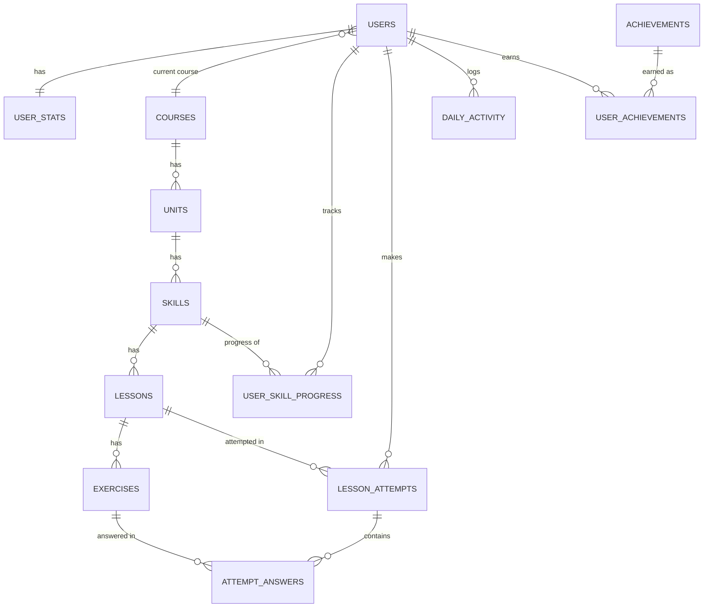
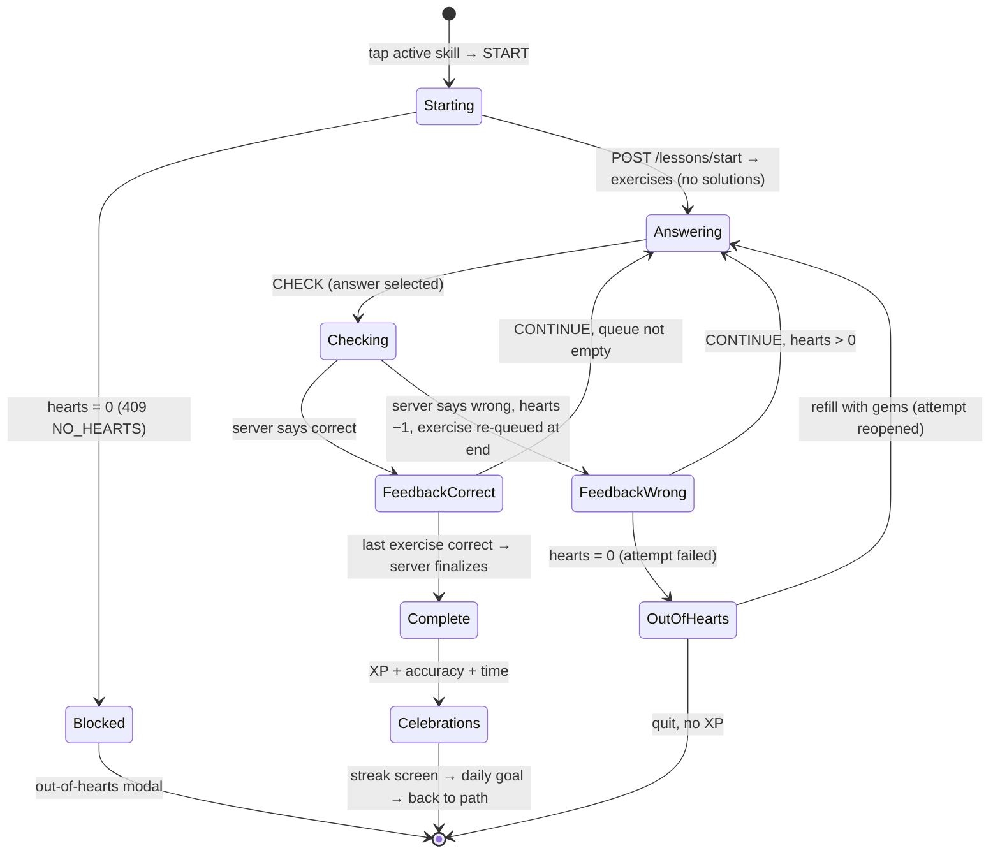

# Duolingo Clone — Implementation Plan (\~15h build, 24h deadline)

Oct 6, 2026 · @Ashutosh

## 1. Assignment breakdown

The grade hinges on one thing: the lesson loop plus XP/streak/hearts working end-to-end with persistent progress, inside a UI that is unmistakably Duolingo. Schema design is called out as explicitly evaluated, so it gets upfront design time.

### Must-have requirements (from the PDF)

| Area | Requirement | Evaluated under | Priority |
| --- | --- | --- | --- |
| Learning path | Visual path of units and skills | Functionality, UI/UX | P0 |
| Learning path | Locked / available / completed states with lock-unlock progression | Functionality | P0 |
| Learning path | Progress rings / crowns per skill | UI/UX | P1 |
| Learning path | Top bar: streak, XP, hearts, mocked gems | Functionality, UI/UX | P0 |
| Lesson player | Lesson = ordered sequence of exercises | Functionality | P0 |
| Lesson player | 5 types: multiple choice, translate (word bank), match pairs, fill in the blank, type the answer | Functionality | P0 |
| Lesson player | Immediate correct/incorrect feedback with the signature feedback bar | UI/UX | P0 |
| Lesson player | Progress bar across the lesson | UI/UX | P0 |
| Lesson player | Lose a heart per wrong answer; failure (0 hearts) handled | Functionality | P0 |
| Lesson player | Award XP and update skill progress on completion | Functionality | P0 |
| Gamification | Streak increments on daily activity; day logic simulated/testable | Functionality | P0 |
| Gamification | XP totals | Functionality | P0 |
| Gamification | Simple leaderboard (seeded allowed) | Functionality | P1 |
| Gamification | Hearts regenerate over time or via mocked practice/refill | Functionality | P0 |
| Gamification | Daily goal / XP goal indicator | UI/UX | P1 |
| Gamification | XP, streak, hearts, completed skills persist per user | Functionality, DB | P0 |
| Content | Units/skills/lessons/exercises stored in DB and seeded | DB design | P0 |
| Content | Learner profile: streak, total XP, achievements | Functionality | P1 |
| Experience | Playful, colourful UI with mascot flourishes | UI/UX | P0 |
| Experience | Animated feedback in the lesson player | UI/UX | P1 |
| Experience | Modals (lesson complete, out of hearts), toasts, celebration states | UI/UX | P0 |
| Experience | Path navigation and progress visuals | UI/UX | P0 |
| Experience | Settings placeholder | UI/UX | P2 |
| Stack | Next.js + TypeScript, FastAPI or Django, SQLite with your own schema | All | P0 |
| Seed | One course, a few units/skills/lessons, varied exercises, sample learner with progress | DB, Functionality | P0 |
| Deliverables | Public GitHub repo containing frontend/ and backend/ | All | P0 |
| Deliverables | README: setup, stack, architecture, schema, API overview, assumptions | Code understanding | P0 |
| Deliverables | Hosted, working demo link | Functionality | P0 |

### Allowed placeholders (a "Coming Soon" screen is enough)

- Speech recognition / pronunciation exercises
- In-app purchases / Super subscription (gems are mocked)
- Friends / social (leaderboard may be seeded)
- Multiple languages (one course)
- Real authentication (a default logged-in learner)

### Bonus (only after every P0/P1 above works)

Audio/TTS · full achievements/badges system · real leaderboard across seeded users · timed/legendary mode · dark mode · responsive design.

### What the evaluators weigh most

1. **Functionality of the lesson loop and XP/streak/hearts** — named explicitly in the Functionality criterion.
2. **Visual similarity** — the PDF says the look must be "exactly the same" in three separate places.
3. **Database design** — the PDF says "This will be evaluated".
4. **Code understanding** — you defend every line in an interview, so avoid abstractions you cannot explain in 30 seconds.

### Ambiguities and the assumption taken

- **Achievements** appear in the must-have profile and in the bonus list. Assumption: the profile shows 5 seeded achievements computed from existing stats; anything richer is bonus.
- **Responsive design** is bonus, yet Duolingo's own layout is responsive. Assumption: desktop-first 3-column layout plus a basic mobile layout (top stats bar, bottom tab bar); it costs about an hour with Tailwind.
- **Crowns**: modern Duolingo replaced crowns with path nodes. Assumption: a progress ring around each node (lessons done / total) and a gold/crowned node state on completion.
- **Simulated day logic**: assumption: a server-side day offset changed through a dev endpoint, exposed as a "Developer tools" panel in Settings.
- **Match pairs and hearts**: Duolingo does not take a heart per mismatched tap. Assumption: match pairs never cost hearts.
- **Leaderboard period**: assumption: weekly XP, Duolingo-league style, computed from activity rows.
- **"Exactly the same" vs "original work"**: reproduce layout, colours, spacing and interaction patterns, but draw an original mascot and icons. Do not ship Duolingo's owl, logo, illustrations or its proprietary font.

**"Modals (lesson complete, out of hearts)"**: the real app shows lesson complete as a full-screen celebration, not a dialog. Assumption: render it as a full-screen overlay using the same `Modal` component (backdrop, enter animation, focus trap), so it satisfies the brief's "modal" wording and still looks like Duolingo. State this in the README.

## 2. Recommended tech stack

Use **FastAPI + SQLAlchemy 2.0 + Pydantic v2** on the backend and **Next.js (App Router) + Tailwind + Framer Motion + TanStack Query** on the frontend. Nothing else is required for the MVP.

### FastAPI (decided)

- You already know FastAPI: zero ramp-up time, and every line is easy to defend in the interview. The app is also a JSON API for a Next.js client; Django's templates, admin and forms add nothing you will be graded on.
- Pydantic **discriminated unions** validate the 5 exercise payload shapes cleanly, and that is the most interview-worthy part of the backend.
- Auto-generated OpenAPI docs at `/docs` double as your "API overview" evidence.
- Fewer files and less magic means every line is easy to explain.
- Trade-off you accept: no built-in admin or migrations. You do not need them; content comes from a seed script, and the schema is created with `create_all` (state this in the README).

### Backend libraries

| Package | Why |
| --- | --- |
| fastapi, uvicorn | API server |
| sqlalchemy 2.x | ORM with typed `Mapped[]` models, explicit relationships |
| pydantic v2, pydantic-settings | Request/response schemas, env config |
| pytest, httpx | A handful of service and API tests |

Skip Alembic, Celery, Redis, JWT auth and Docker Compose. Hearts regeneration and streak breaks are computed lazily on read, so no background jobs are needed.

### Frontend libraries

| Package | Why |
| --- | --- |
| next, react, typescript | Required stack |
| tailwindcss | Fast pixel-matching; design tokens in the Tailwind config |
| framer-motion | Feedback bar slide-up, tile fly (`layoutId`), heart shake, node bounce, modals |
| @tanstack/react-query | Server-state cache; invalidate `me` and `path` after a lesson |
| canvas-confetti (≈ small) | Lesson-complete celebration |
| next/font (Nunito) | Closest free match to Duolingo's rounded bold type |

Skip Redux/Zustand (React Query + one `useReducer` covers everything), component kits like MUI/shadcn (they look generic and fight the Duolingo look), and icon packs. Draw icons as small inline SVG components so they stay original and on-palette.

## 3. High-level architecture

The backend is the single source of truth for every number the user sees (XP, hearts, streak, progress, answer correctness); the frontend renders and animates. That one rule removes most consistency bugs and is the cleanest thing to say in the interview.

### Repository layout

```
duolingo-clone/
├── README.md
├── docs/                      # schema diagram, screenshots
├── backend/
│   ├── app/
│   │   ├── main.py            # app factory, CORS, router registration
│   │   ├── config.py          # pydantic-settings (env vars)
│   │   ├── db.py              # engine, SessionLocal, PRAGMA foreign_keys=ON
│   │   ├── deps.py            # get_db, get_current_user (default learner)
│   │   ├── models/            # SQLAlchemy: user.py, course.py, progress.py, gamification.py
│   │   ├── schemas/           # Pydantic: me.py, path.py, lesson.py, exercises.py, leaderboard.py
│   │   ├── services/          # business rules (pure-ish, testable)
│   │   │   ├── clock.py       # today() with simulated day offset
│   │   │   ├── hearts.py      # lazy regen, lose, refill
│   │   │   ├── streak.py      # extend / break logic
│   │   │   ├── path.py        # derive locked/active/completed
│   │   │   ├── lesson_engine.py  # start, answer, finalize
│   │   │   ├── grading.py     # one grader per exercise type
│   │   │   ├── achievements.py
│   │   │   └── leaderboard.py
│   │   ├── api/               # routers: me, path, lessons, hearts, leaderboard, dev
│   │   └── seed/              # content.py (vocab data), generator.py, run.py
│   ├── data/                  # app.db (gitignored)
│   ├── tests/
│   └── requirements.txt
└── frontend/
    ├── src/app/
    │   ├── (main)/layout.tsx  # sidebar + right rail shell
    │   ├── (main)/learn/page.tsx
    │   ├── (main)/leaderboard/page.tsx
    │   ├── (main)/profile/page.tsx
    │   ├── (main)/settings/page.tsx
    │   ├── (main)/shop|quests/page.tsx   # Coming Soon
    │   └── lesson/[attemptId]/page.tsx   # full-screen, no shell
    ├── src/components/  ui/ layout/ path/ lesson/ lesson/exercises/ gamification/ mascot/
    ├── src/lib/         api.ts  types.ts  queries.ts  lessonReducer.ts
    └── tailwind.config.ts   # Duolingo design tokens
```

There is no separate `database/` folder: SQLite is one file under `backend/data/`, created by `python -m app.seed.run`. The schema lives in code (`models/`) and is documented in the README.

### Responsibilities

| Layer | Owns | Never does |
| --- | --- | --- |
| Frontend (Next.js) | Rendering, animations, lesson UI state machine, local answer selection, routing | Computes XP, hearts, streak, unlocks, or grades answers (except match-pair taps) |
| API routers | HTTP shape, status codes, calling one service function | Business rules |
| Services | All rules: grading, hearts regen, streak, XP, unlocks, achievements; transactions | HTTP concerns |
| Models / DB | Persistence, FK + CHECK + UNIQUE constraints | Derived state (locked/active is computed, not stored) |

### API communication

REST + JSON under `/api`. The frontend calls the backend through one typed `api.ts` wrapper (base URL from `NEXT_PUBLIC_API_URL`). All pages are client components fed by React Query; no server-side rendering of user data is needed, which avoids a second fetch path to explain.

### Default-user strategy

`get_current_user()` is a FastAPI dependency that returns user id 1 (the seeded learner). It optionally reads an `X-User-Id` header so you can demo another seeded user. Every route takes `user = Depends(get_current_user)`, so swapping in real auth later touches one function. Say exactly that in the README assumptions.

### Lesson state through the system

1. Path page → `POST /api/lessons/start {skill_id}` → service creates a `lesson_attempts` row and returns exercises **without answers**.
2. Frontend navigates to `/lesson/{attemptId}`; a refresh reloads via `GET /api/attempts/{id}`.
3. Each Check → `POST /api/attempts/{id}/answer` → server grades, writes `attempt_answers`, deducts a heart on a wrong answer, returns correctness + correct solution + hearts.
4. When the last required exercise is answered correctly, the same request finalizes the attempt in one transaction: XP, daily activity, streak, skill progress, achievements.
5. Completion screens render the returned summary; React Query invalidates `me`, `path`, `leaderboard`.

## 4. Database design

Fourteen tables in three groups: **content** (course → unit → skill → lesson → exercise), **learner state** (user, stats, skill progress, daily activity, achievements) and **lesson history** (attempts, answers). Lock/unlock state is derived, never stored, so it can never go out of sync.

### ER diagram (paste the same block into the README; GitHub renders Mermaid)



### Content tables

| Table | Fields (type) | Keys & constraints |
| --- | --- | --- |
| courses | id INT, code TEXT, title TEXT, learning\_language TEXT, from\_language TEXT | PK id · UNIQUE code |
| units | id INT, course\_id INT, position INT, title TEXT, description TEXT, color TEXT | PK id · FK course\_id → courses ON DELETE CASCADE · UNIQUE(course\_id, position) |
| skills | id INT, unit\_id INT, position INT, title TEXT, icon TEXT | PK id · FK unit\_id → units CASCADE · UNIQUE(unit\_id, position) |
| lessons | id INT, skill\_id INT, position INT, xp\_reward INT DEFAULT 10 | PK id · FK skill\_id → skills CASCADE · UNIQUE(skill\_id, position) · CHECK xp\_reward > 0 |
| exercises | id INT, lesson\_id INT, position INT, type TEXT, prompt TEXT, payload JSON, solution JSON | PK id · FK lesson\_id → lessons CASCADE · UNIQUE(lesson\_id, position) · CHECK type IN ('multiple\_choice','translate','match\_pairs','fill\_blank','type\_answer') |

### Learner-state tables

| Table | Fields (type) | Keys & constraints |
| --- | --- | --- |
| users | id INT, username TEXT, display\_name TEXT, avatar\_color TEXT, timezone TEXT DEFAULT 'Asia/Kolkata', daily\_goal\_xp INT DEFAULT 20, current\_course\_id INT, created\_at DATETIME | PK id · UNIQUE username · FK current\_course\_id → courses · CHECK daily\_goal\_xp IN (10,20,30,50) |
| user\_stats | user\_id INT, total\_xp INT, gems INT, hearts INT, hearts\_updated\_at DATETIME, current\_streak INT, longest\_streak INT, last\_active\_date DATE NULL | PK + FK user\_id → users CASCADE (1:1) · CHECK hearts BETWEEN 0 AND 5 · CHECK total\_xp, gems, streaks ≥ 0 |
| user\_skill\_progress | user\_id INT, skill\_id INT, lessons\_completed INT, completed\_at DATETIME NULL, updated\_at DATETIME | PK(user\_id, skill\_id) · FKs → users, skills CASCADE · CHECK lessons\_completed ≥ 0 |
| daily\_activity | user\_id INT, activity\_date DATE, xp\_earned INT, lessons\_completed INT | PK(user\_id, activity\_date) · FK → users CASCADE |
| achievements | id INT, code TEXT, title TEXT, description TEXT, icon TEXT, metric TEXT, threshold INT | PK id · UNIQUE code · CHECK metric IN ('total\_xp','streak','lessons','skills','perfect\_lessons') |
| user\_achievements | user\_id INT, achievement\_id INT, unlocked\_at DATETIME | PK(user\_id, achievement\_id) · FKs CASCADE |
| app\_settings | key TEXT, value TEXT | PK key · holds `day_offset` for the simulated clock |

### Lesson-history tables

| Table | Fields (type) | Keys & constraints |
| --- | --- | --- |
| lesson\_attempts | id INT, user\_id INT, lesson\_id INT, mode TEXT, status TEXT, mistakes INT, xp\_earned INT, started\_at DATETIME, finished\_at DATETIME NULL | PK id · FKs → users, lessons · CHECK mode IN ('learn','practice') · CHECK status IN ('in\_progress','completed','failed','abandoned') · INDEX(user\_id, status) |
| attempt\_answers | id INT, attempt\_id INT, exercise\_id INT, submitted JSON, is\_correct BOOL, answered\_at DATETIME | PK id · FK attempt\_id → lesson\_attempts CASCADE · FK exercise\_id → exercises · INDEX(attempt\_id) |

### Design decisions you should be ready to defend

- **Exercise `payload`/`solution` as JSON columns.** The 5 types have different shapes, and nothing ever queries inside them. Five subtype tables would add joins with zero query benefit. Integrity comes from Pydantic discriminated unions validated at seed time and on read. `solution` is separate from `payload` so answers are never serialized to the client by accident.
- **`user_stats` split from `users`.** Identity changes rarely; counters change every lesson. Keeps the 1:1 explicit and the hot row small.
- **`total_xp` is a deliberate denormalization** of SUM(daily\_activity.xp\_earned), updated in the same transaction. Reads stay O(1); the activity table stays the audit trail and powers weekly XP.
- **Locked / active / completed is computed** from `user_skill_progress` + ordering by (unit.position, skill.position). Storing it would create a second truth.
- **SQLite enforces FKs only with `PRAGMA foreign_keys=ON`** per connection. Set it in a SQLAlchemy `connect` event listener, or none of the FK constraints above are real.

### How the schema supports each mechanic

- **Skill unlocking**: the path service walks skills in order; the first skill whose `lessons_completed < lesson_count` is *active*, those before it are *completed*, those after are *locked*. A unit is locked when its first skill is locked.
- **Lesson completion**: `lesson_attempts.status = 'completed'` once every exercise has a correct `attempt_answers` row. In `learn` mode it bumps `user_skill_progress.lessons_completed`; `completed_at` is set when it reaches the skill's lesson count.
- **XP**: on completion, `xp_reward` (+5 if `mistakes = 0`) is added to `user_stats.total_xp`, `lesson_attempts.xp_earned` and today's `daily_activity` row (upsert).
- **Hearts**: `hearts` + `hearts_updated_at` allow lazy regeneration: on every read, add `floor(elapsed / REGEN_INTERVAL)` hearts up to 5 and advance the timestamp by the consumed intervals.
- **Streaks**: `last_active_date` vs today decides extend (+1 if yesterday), keep (same day), or reset (older). `longest_streak` keeps the record.
- **Daily goal**: `users.daily_goal_xp` vs today's `daily_activity.xp_earned`.
- **Persistence**: every mechanic above lives in rows keyed by `user_id`; nothing gamified lives only in the browser.

## 5. Backend / API plan

Fifteen endpoints cover everything. The lesson is driven by three: **start**, **answer**, **get attempt**; finalization happens inside the answer call that completes the lesson, so XP can never be awarded twice or without a finished lesson.

### User / profile

| Method & URL | Purpose | Request | Response | DB work |
| --- | --- | --- | --- | --- |
| GET /api/me | Top-bar data | — | `{user, stats:{total_xp, gems, hearts, max_hearts, next_heart_at, current_streak, longest_streak, streak_active_today}, daily:{goal_xp, today_xp}}` | Read users + user\_stats; apply lazy heart regen and streak expiry, persist if changed; read today's daily\_activity |
| GET /api/me/profile | Profile page | — | `{user, stats, achievements:[{code,title,icon,unlocked_at\|null}], course_progress:{skills_completed, skills_total}, week_xp:[{date, xp}×7]}` | Joins over achievements, user\_skill\_progress, daily\_activity |
| PATCH /api/me/settings | Daily goal, display name | `{daily_goal_xp?, display_name?}` | `MeResponse` | Update users (CHECK on goal) |

### Learning path

| Method & URL | Purpose | Request | Response | DB work |
| --- | --- | --- | --- | --- |
| GET /api/path | Whole path for the current course | — | `{course, units:[{id, position, title, description, color, state, skills:[{id, title, icon, state:'locked'\|'active'\|'completed', lessons_completed, lesson_count}]}]}` | 1 query for units+skills+lesson counts, 1 for user\_skill\_progress; state derived in `services/path.py` |

### Lessons and exercises

| Method & URL | Purpose | Request | Response | DB work |
| --- | --- | --- | --- | --- |
| POST /api/lessons/start | Begin a lesson for a skill | `{skill_id}` | `{attempt_id, mode, lesson:{id, position, skill_title}, exercises:[{id, type, prompt, payload}], hearts}` (no solutions) | Reject locked skill (403) and hearts = 0 (409 `NO_HEARTS`); pick lesson = lessons\_completed + 1, or a random lesson if the skill is complete (`practice`); abandon any other in-progress attempt; insert lesson\_attempts |
| GET /api/attempts/{id} | Resume after refresh / show result | — | Same as start + `answered:[{exercise_id, is_correct}]`, `status`, `result` if completed | Read attempt + answers |
| POST /api/attempts/{id}/answer | Grade one exercise | `{exercise_id, answer}` | `{correct, correct_solution, feedback_note?, hearts, status, result?}` | Grade via `grading.py`; insert attempt\_answers; if wrong: hearts −1, mistakes +1; if hearts hit 0: status `failed`; if all exercises now correct: finalize (below) |
| POST /api/attempts/{id}/quit | User presses X | — | `{status:'abandoned'}` | Update attempt (hearts already lost stay lost, as in Duolingo) |

### Gamification

| Method & URL | Purpose | Request | Response | DB work |
| --- | --- | --- | --- | --- |
| POST /api/hearts/refill | Mocked gem refill | — | `MeResponse` | gems ≥ 350 else 409 `NOT_ENOUGH_GEMS`; set hearts = 5, gems −350; if an attempt was `failed` by hearts, reopen it to `in_progress` |
| POST /api/hearts/practice | "Practice to earn hearts" placeholder | — | `MeResponse` | +1 heart (cap 5); clearly labelled mock |
| GET /api/leaderboard?period=week | Weekly league | — | `{period_start, period_end, entries:[{rank, user_id, display_name, avatar_color, xp, is_me}]}` | users LEFT JOIN this week's daily\_activity, COALESCE(SUM(xp\_earned), 0) for the current Mon–Sun week, GROUP BY user, ORDER BY xp DESC. The LEFT JOIN keeps learners with 0 XP this week (everyone on a Monday) on the board at 0 instead of vanishing |
| GET /api/achievements | All badges with unlock state | — | list | achievements LEFT JOIN user\_achievements |

### Dev tools (enabled by `ENABLE_DEV_TOOLS=true`)

| Method & URL | Purpose | DB work |
| --- | --- | --- |
| POST /api/dev/advance-day `{days: 1}` | Simulate the next day to test streaks and regen | app\_settings.day\_offset += days |
| POST /api/dev/reset | Restore seed state before a demo | Drop + recreate + reseed |
| GET /api/health | Uptime check, wakes a sleeping host | — |

### Finalize (inside the completing answer call, one transaction)

1. `xp = lesson.xp_reward + (5 if mistakes == 0 else 0)`.
2. user\_stats.total\_xp += xp; attempt.xp\_earned = xp; status `completed`.
3. Upsert daily\_activity(user, today): xp\_earned += xp, lessons\_completed += 1.
4. Streak service: extend / keep / reset; update longest\_streak; record `streak_extended`.
5. If mode = `learn`: user\_skill\_progress.lessons\_completed += 1; set completed\_at when it equals lesson count.
6. Achievements service: insert newly crossed thresholds.
7. Return `result:{xp_earned, accuracy, mistakes, duration_s, streak:{count, extended}, daily_goal:{today_xp, goal_xp, just_met}, skill_completed, achievements_unlocked:[]}`.

Guard: if the attempt is already `completed`, return the stored result instead of finalizing again (idempotent on double-click or retry).

### Code structure

- **Pydantic schemas** (`schemas/`): request/response models per router; `ExercisePublic` (no solution) vs internal `ExerciseFull`; payloads as a discriminated union on `type` (`MultipleChoicePayload`, `TranslatePayload`, …) so a malformed seed fails loudly.
- **Services**: plain functions taking `(db, user, …)`; they own commit/rollback for multi-row writes. `clock.today(db, user)` is the only place that knows the date.
- **Data access**: keep queries inside services; extract a `repositories/` function only when two services need the same query. Over-layering is harder to explain than it is worth here.
- **Errors**: a custom `AppError(code, message, status)` with one exception handler returning `{error:{code, message}}`. Codes: `SKILL_LOCKED` 403, `NO_HEARTS` 409, `NOT_ENOUGH_GEMS` 409, `ATTEMPT_CLOSED` 409, `EXERCISE_NOT_IN_ATTEMPT` 400, `NOT_FOUND` 404. The frontend maps codes to modals/toasts.
- **Validation**: Pydantic validates request shapes; services validate ownership (attempt.user\_id == user.id), state (attempt in progress), and membership (exercise belongs to the attempt's lesson).
- **CORS**: `CORSMiddleware` with `allow_origins` from `CORS_ORIGINS` (localhost:3000 + the Vercel domain). Never `*` together with credentials.

## 6. Lesson engine design

One registry on each side makes 5 exercise types cheap: the backend maps `type → grader`, the frontend maps `type → component`, and the lesson player itself never branches on type. Adding a sixth type later is one payload schema, one grader and one component.

### Flow (state machine; paste into the README too)



### Step by step

1. **Select skill**: tapping an active or completed node opens a popover ("Lesson 2 of 3", START / PRACTICE +XP button). Locked nodes show "Complete all levels above to unlock this!".
2. **Start**: `POST /api/lessons/start`; on success `router.replace('/lesson/' + attemptId)`.
3. **Fetch**: the lesson page calls `GET /api/attempts/{id}` (works for both fresh starts and refresh) and hydrates the reducer.
4. **Display**: the player renders `EXERCISE_REGISTRY[exercise.type]`. The Check button is disabled until the component reports a non-null answer.
5. **Validate**: `POST /api/attempts/{id}/answer`. The Check button shows a pressed state while waiting (local ≈ 20 ms, hosted ≈ 150–400 ms, acceptable).
6. **Feedback**: the footer turns green ("Nice!", "Great job!") or red ("Correct solution:" + the answer). Correct also bumps a combo counter ("3 in a row" flag over the progress bar at 3+).
7. **Heart loss**: hearts come from the response, never decremented locally; animate the heart icon shake on change.
8. **Next**: CONTINUE pops the queue. Wrong exercises were appended to the end, Duolingo-style, so a lesson ends only when every exercise has been answered correctly once.
9. **End**: either the response carries `status: 'failed'` (out-of-hearts modal) or `result` (completion flow).
10. **Award**: already done server-side in the same request (section 5 Finalize); the client only displays `result`.
11. **Celebrate**: lesson-complete screen → streak screen (only if `streak.extended`) → daily-goal screen (only if `daily_goal.just_met`) → `/learn`, with the next node now active.

Progress bar value = `correctCount / totalExercises`, so a wrong answer does not move it, exactly as in the real app.

### Exercise types: storage, rendering, grading

| type | UI (prompt header) | `payload` (sent to client) | `solution` (server only) | Grader rule |
| --- | --- | --- | --- | --- |
| multiple\_choice | "Which one of these is 'water'?" · 3–4 picture cards, keys 1–4 | `{options:[{id, text, emoji}]}` | `{option_id}` | Exact id match |
| translate | "Write this in English" · mascot speech bubble, answer line, tile bank | `{source_text, tiles:[{id, text}]}` (correct tiles + 2–4 distractors, shuffled at seed) | `{accepted:[["The","boy","drinks","water"], …]}` | Submitted tile texts, lowercased, equal one accepted sequence |
| match\_pairs | "Tap the matching pairs" · two columns of 5 | `{left:[{id, text, pair}], right:[{id, text, pair}]}` | `{}` | Client validates taps (pair key is intrinsic to the exercise); submits `{pairs, mismatches}`; server re-checks pairs; never costs a heart |
| fill\_blank | "Select the missing word" · sentence with gap, 3–4 options | `{before, after, options:[…]}` | `{accepted:["bebo"]}` | Normalized match |
| type\_answer | "Type this in Spanish" · textarea, keyboard-first | `{source_text, input_language}` | `{accepted:["bebo agua", …]}` | Normalize (lowercase, trim, collapse spaces, strip `.,!?¿¡`); accent-only difference → correct + "Pay attention to the accents"; Levenshtein ≤ 1 on answers ≥ 5 chars → correct + "You have a typo" |

### Frontend contract (keeps the player clean)

- `ExerciseProps = { exercise, locked, onAnswerChange(answer | null) }`. Every component keeps its own selection state and reports a serializable answer.
- The player owns the footer (Skip / Check / Continue), the header (X, progress bar, hearts) and keyboard shortcuts (Enter = check/continue).
- `lessonReducer` state: `phase` ('answering' | 'checking' | 'feedback' | 'outOfHearts' | 'complete'), `queue`, `correctIds`, `currentAnswer`, `feedback`, `hearts`, `combo`, `result`. Actions: `HYDRATE`, `SET_ANSWER`, `CHECK_START`, `CHECK_RESULT`, `CONTINUE`, `REFILLED`. A pure reducer is easy to unit-test and to explain line by line.
- Match pairs auto-submits when the last pair locks; it has no Check button, as in the real app.
- "Skip" is shown but sends the attempt as a wrong answer (Duolingo's "Can't listen now" equivalent is not needed).

## 7. Frontend page / component plan

Five routes plus two placeholder routes. Everything except the lesson lives inside one shell layout (left sidebar, centre column, right rail), which is what makes the app read as Duolingo at first glance.

### Pages

| Route | Purpose | API calls | Key state | Major components | Interactions / navigation |
| --- | --- | --- | --- | --- | --- |
| `/learn` (home, `/` redirects) | The path | `GET /api/path`, `GET /api/me`, `GET /api/leaderboard` (rail card) | Selected node (popover open), React Query caches | `UnitHeader`, `PathColumn`, `SkillNode`, `ProgressRing`, `NodePopover`, `MascotFlourish`, `StatsBar`, `DailyGoalCard`, `LeagueCard` | Tap node → popover → START → `POST /lessons/start` → `/lesson/[id]`; locked tap → shake + tooltip; auto-scroll to active node on load |
| `/lesson/[attemptId]` | Lesson player, full screen | `GET /api/attempts/{id}`, `POST …/answer`, `POST …/quit`, `POST /hearts/refill` | `lessonReducer` | `LessonHeader`, `LessonProgressBar`, `HeartsCounter`, `ExerciseRenderer` + 5 exercise components, `FeedbackFooter`, `QuitConfirmModal`, `OutOfHeartsModal` | X → "Wait, don't go!" modal; Enter/number keys; on complete → celebration sequence |
| (in-lesson) completion sequence | Lesson complete, streak, daily goal | none (uses `result`) | Step index | `LessonCompleteScreen` (3 stat cards: Total XP, Accuracy, Time), `StreakScreen`, `DailyGoalScreen`, confetti | CONTINUE through screens → invalidate queries → `/learn` |
| `/leaderboard` | Weekly league | `GET /api/leaderboard` | — | `LeagueHeader` (tier badge, "ends in N days"), `LeaderboardRow`, promotion zone divider | Own row highlighted and scrolled into view |
| `/profile` | Stats + achievements | `GET /api/me/profile` | — | `ProfileHeader` (avatar initial, name, joined date), `StatTile`×4 (streak, total XP, league, skills done), `WeekXpChart`, `AchievementCard` with tier progress | Edit-profile button → Coming Soon toast |
| `/settings` | Placeholder + daily goal + dev tools | `PATCH /api/me/settings`, `POST /api/dev/*` | Form state | `SettingsSection`, `GoalPicker` (Casual 10 / Regular 20 / Serious 30 / Intense 50), `DevToolsPanel` (Advance day, Reset demo) | Save → toast "Settings saved" |
| `/quests`, `/shop`, `/friends` | Placeholders the brief allows | — | — | `ComingSoon` with mascot | Sidebar links work, so navigation feels complete |

### Shared components

- **Layout**: `Sidebar` (logo wordmark in original text, nav items with icons and active state), `RightRail`, `MobileTopBar`, `MobileTabBar`.
- **UI primitives**: `Button` (variants: primary green, secondary blue, danger red, ghost, locked grey; sizes), `Card`, `Modal` (Framer `AnimatePresence`), `Toast` (top-centre pill), `ProgressBar`, `Tooltip`, `Skeleton`.
- **Gamification**: `StreakBadge`, `GemsBadge`, `HeartsBadge` (with dropdown showing "next heart in 3:12:05" and REFILL / PRACTICE buttons), `XpPill`.
- **Mascot**: one original SVG character with 3 poses (idle, happy, sad) used on the path, in feedback, in the out-of-hearts modal and on celebration screens.

## 8. Duplicating the Duolingo UX

Three signatures do most of the work: **3D buttons with a darker bottom edge that press down**, **the zig-zag path of round nodes**, and **the coloured feedback footer that slides up**. Get those pixel-close before anything else. Spend 30 minutes with duolingo.com open and screenshots side by side; the hex values below are commonly cited approximations, so verify them with DevTools.

### Design tokens (put in `tailwind.config.ts`)

| Token | Hex | Bottom-edge / shade | Used for |
| --- | --- | --- | --- |
| green | #58CC02 | #58A700 | Primary buttons, active node, correct, progress fill |
| blue | #1CB0F6 | #1899D6 | Secondary buttons, selected option border, gems tint |
| red | #FF4B4B | #EA2B2B | Hearts, wrong answers, danger |
| orange | #FF9600 | #CD7900 | Streak flame |
| yellow / gold | #FFC800 | #E5B400 | XP, completed crown, chest, daily goal |
| purple | #CE82FF | #A568CC | Unit 2 theme, achievements |
| text | #4B4B4B | — | Body text |
| muted text | #777777 / #AFAFAF | — | Secondary text, locked labels |
| border | #E5E5E5 | — | Card borders (2px), dividers |
| surface | #FFFFFF / #F7F7F7 | — | Page, rail cards |
| correct footer | #D7FFB8 bg, #58A700 text | — | Feedback bar |
| wrong footer | #FFDFE0 bg, #EA2B2B text | — | Feedback bar |

### Typography

- Nunito via `next/font`, weights 700 and 800 only; Duolingo text is almost never regular weight.
- Buttons: 15px, 800, uppercase, letter-spacing 0.8px. Exercise prompt: 24–32px, 800. Body: 17px, 700.

### Buttons

- `rounded-2xl` (16px), height 50px, `border-b-4` in the shade colour, no visible shadow blur.
- Hover: brightness +5%. Active: `translate-y-[4px]` and `border-b-0` (or `border-b-[0px]` with matching margin) so it physically presses.
- Disabled: bg #E5E5E5, text #AFAFAF, shade #E5E5E5 (CHECK before an answer is chosen).
- Option cards and word tiles use the same 3D idea in white: 2px #E5E5E5 border + 4px bottom border; selected = blue border + #DDF4FF bg.

### Path and skill nodes

- Unit header: full-width rounded 16px banner in the unit colour, "UNIT 1" (small caps) + title, a GUIDEBOOK button on the right (opens Coming Soon).
- Nodes: 70px circles, icon inside, 3D via `box-shadow: 0 8px 0 <shade>`; pressed = shadow 0 and translateY(8px).
- Zig-zag: x-offset per node index from the repeating pattern `[0, 45, 70, 45, 0, −45, −70, −45]` px.
- States: **locked** grey #E5E5E5 with lock icon; **active** unit colour + 100px progress ring (SVG circle, `stroke-dasharray`) + bouncing "START" speech bubble above; **completed** gold #FFC800 with crown/check icon.
- Every 4th position, place the mascot (or a chest node) beside the path in the empty side: this is the "mascot-style flourish".

### Top bar / right rail indicators

- Desktop: right rail top row = course flag, streak (flame + number, orange when active today, grey otherwise), total XP (gold bolt + number; the real app hides XP here, but the brief explicitly requires it in the top bar), gems (blue gem + number), hearts (red heart + number). Mobile: same row pinned at top.
- Hearts badge dropdown: 5 hearts, "Next heart in HH:MM:SS" countdown from `next_heart_at`, REFILL (350 gems) and PRACTICE buttons.
- Rail cards: Daily Quests-style "Earn 20 XP" card with a yellow progress bar and chest; Weekly league card with rank.

### Lesson screen

- Header: grey X (left), 16px-tall progress bar (rounded, grey #E5E5E5 track, green fill with a lighter 4px highlight stripe near the top), red heart + count (right).
- Body max-width 600px, centred; prompt heading on top, exercise below.
- Footer: full-width, 140px tall, top border 2px #E5E5E5; SKIP (ghost) left, CHECK right.
- Feedback: footer bg switches to the correct/wrong colour, slides up 200ms; left shows a round white icon (check or X), title ("Nice!", "Correct solution:"), and on the right a CONTINUE button in green or red.

### Modals and toasts

- Modal: white card, 16px radius, mascot illustration on top, big bold title, full-width primary + ghost buttons stacked; backdrop rgba(0,0,0,0.5).
- Quit modal: "Wait, don't go! You'll lose your progress if you quit now" → KEEP LEARNING / END SESSION.
- Out-of-hearts: "You ran out of hearts!" → REFILL (350 gems) / NO THANKS.
- Toast: top-centre pill, auto-dismiss 2.5s ("Settings saved", "Coming soon!").

### Animations (Framer Motion)

| Moment | Animation |
| --- | --- |
| Feedback footer | Slide up from y: 100% with spring, 200ms |
| Word bank tiles | Shared `layoutId` so a tile flies from bank to answer line and back; empty slot keeps its grey placeholder |
| Wrong answer | Heart icon shake + scale 1.3 → 1; selected card shakes horizontally |
| Correct answer | Selected card pulses green; combo flag over progress bar at 3+ in a row |
| Progress bar | Width spring animation |
| Active node | START bubble bobbing (y ±4px, 1.2s loop) |
| Match pairs | Matched pair flashes green then greys out; mismatch flashes red for 400ms |
| Lesson complete | Confetti burst, mascot jump, stat cards scale-in staggered, XP count-up |
| Streak screen | Flame scales in, number ticks from N−1 to N |

### Responsive behaviour (cheap version of the bonus)

- ≥ 1024px: sidebar (256px) + centre (600px) + rail (368px).
- 768–1023px: icon-only sidebar, no rail; stats row on top of centre.
- < 768px: top stats bar + bottom tab bar (Learn, Leaderboard, Profile, More); lesson footer buttons go full width.

## 9. Seed data plan

Seed **Spanish for English speakers: 3 units × 4 skills × 3 lessons × 8 exercises = 288 exercises**, generated deterministically from about 100 hand-written vocabulary items and sentences. Hand-authoring 288 exercises would eat 4+ hours; a generator takes about 1.5 and is a good interview talking point.

### Course structure

| Unit (colour) | Skills (4 each) |
| --- | --- |
| 1 · Form basic sentences (green) | Greetings · Food & Drink · Family · People |
| 2 · Get around a city (blue) | Places · Travel · Directions · Time |
| 3 · Talk about your day (purple) | Routine · Weather · Hobbies · Feelings |

### Per-skill source data (`seed/content/`, one file per unit)

- 8 vocabulary pairs: `("agua", "water", "💧")`, `("pan", "bread", "🍞")` …
- 5 sentence pairs with tokens: `es="Yo bebo agua"`, `en="I drink water"`, plus 1–2 accepted alternatives ("I am drinking water").

### Generator rules (`seed/generator.py`, seeded with `unit_position * 10 + skill_position` so output is stable and independent of database ids)

Each lesson gets 8 exercises in this order, so even lesson 1 shows all five types:

| Position | Type | Built from |
| --- | --- | --- |
| 1 | multiple\_choice | a vocab item + 2–3 other vocab items as distractors, emoji as the picture |
| 2 | match\_pairs | 5 vocab pairs |
| 3 | translate (es → en tiles) | a sentence + 3 distractor words from the skill |
| 4 | fill\_blank | a sentence with one word removed + 3 options |
| 5 | multiple\_choice | reverse direction ("How do you say 'bread'?") |
| 6 | translate (en → es tiles) | another sentence |
| 7 | fill\_blank | another sentence |
| 8 | type\_answer | a short sentence or vocab item |

Totals: 72 multiple choice, 72 translate, 36 match pairs, 72 fill-in-the-blank, 36 type-the-answer. The generator validates every payload through the Pydantic union before insert, so a bad seed fails at startup, not in the demo.

### Demo learner (user id 1)

| Field | Seed value | Why |
| --- | --- | --- |
| Progress | Unit 1 skills 1–3 completed, skill 4 at 1/3 lessons; Units 2–3 locked | Path shows all three node states and a partial ring |
| History | 10 completed lesson\_attempts (3 with 0 mistakes) and 14 days of daily\_activity with one gap | Profile chart and stats are real, not hard-coded |
| total\_xp | Computed as the sum of seeded daily\_activity (≈ 200) | Keeps the denormalized total consistent |
| Streak | current 6, longest 9, last\_active\_date = yesterday | The first lesson today extends it to 7 and triggers the streak screen |
| Hearts | 4 of 5, `hearts_updated_at` = now − 20 min | Shows the regen countdown immediately |
| Gems | 1200 | Enough for 3 refills during evaluation |
| Daily goal | 20 XP, today 0 XP | The first lesson moves the goal bar visibly; the second meets it |

### Other seed data

- **14 other learners** with names, avatar colours and this-week daily\_activity from 15 to 320 XP. Put the demo learner 8th, with the 7th place only 10 XP ahead, so one lesson visibly climbs the table.
- **5 achievements**: First Steps (1 lesson, unlocked), Wildfire (7-day streak, locked at 6/7 so the first lesson unlocks it), Sage (250 XP), Scholar (4 skills, unlocked by finishing skill 4), Perfectionist (5 perfect lessons).
- The seeder computes stats from history rather than typing totals, so every number on screen is internally consistent.
- `HEART_REGEN_MINUTES` defaults to 30 for the demo (the real app is several hours); state this in the README.

## 10. State management plan

The server owns every number; React Query mirrors it; one reducer owns the transient lesson UI; the URL owns only "which attempt am I in".

| Where | What lives there | Notes |
| --- | --- | --- |
| Database (server) | XP, gems, hearts + timestamp, streak, daily activity, skill progress, attempts, answers, achievements, settings, simulated day offset | The only source of truth |
| React Query cache | `['me']`, `['path']`, `['profile']`, `['leaderboard']`, `['attempt', id]` | Read-only mirror; refetched or patched from mutation responses |
| `lessonReducer` (React) | Current queue, selected answer, phase, feedback content, combo, celebration step | Lost on refresh by design; rebuilt from `GET /api/attempts/{id}` |
| Component state | Popover open, tile order on the answer line, match-pair selection, textarea value | Purely visual |
| URL | `/lesson/[attemptId]`, active nav route | Makes refresh and back-button safe |

### Rules that prevent XP / hearts / streak drift

1. **Never compute gamified numbers on the client.** The hearts counter shows `response.hearts`; XP shows `result.xp_earned`. No `hearts - 1` anywhere in the frontend.
2. **No optimistic updates** for hearts, XP or progress. A 200 ms wait behind a pressed CHECK button is invisible; a rollback after a wrong guess is a visible bug.
3. **Patch caches from responses.** After an answer, `queryClient.setQueryData(['me'], …hearts)`; after completion, `invalidateQueries(['me','path','profile','leaderboard'])`.
4. **Lazy server-side recomputation on read.** `GET /api/me` applies heart regen and streak expiry, so a tab left open overnight shows correct values after `refetchOnWindowFocus`.
5. **Idempotent finalize.** A double-clicked CONTINUE or a network retry on the completing answer returns the stored result, never a second XP award (guard on `status`).
6. **One clock.** `services/clock.py` provides `now()` and `today()` (user timezone + `day_offset`). Streak, daily goal, leaderboard week and heart regen all call it, so day simulation moves everything together.
7. **One in-progress attempt per user.** Starting a new lesson abandons the old one, so stale tabs cannot finalize twice.

## 11. Implementation order

Build backend-first through the lesson API, then the frontend in the order a user experiences it. One deviation from a naive order: deploy a hello-world of both apps in Phase 1, because hosting surprises are the most common reason for a late submission.

| Phase | Implement | Depends on | Outcome | Test before moving on |
| --- | --- | --- | --- | --- |
| 1 · Setup | Monorepo; `create-next-app` (TS, Tailwind, App Router); FastAPI skeleton with `/api/health`, CORS, settings; Nunito + design tokens; `api.ts`; push to GitHub; deploy both hello-worlds | — | Live frontend URL calling live `/api/health` | Health check works locally and deployed; CORS OK from the Vercel domain |
| 2 · Schema | SQLAlchemy models for all 14 tables, constraints, `PRAGMA foreign_keys=ON`, `create_all` | 1 | `app.db` with correct tables | Inserting a row with a bad FK or bad `type` fails; `sqlite3 .schema` matches the doc |
| 3 · Seed | `content.py` vocab, generator, Pydantic payload union, demo learner + history, other learners, achievements; `python -m app.seed.run` (drop + create + seed) | 2 | Populated DB in one command | Counts: 3 units, 12 skills, 36 lessons, 288 exercises; learner totals equal sums of history |
| 4 · Backend APIs | Services (clock, hearts, streak, path, grading, lesson\_engine, achievements, leaderboard) then routers; error handler. Leaderboard: LEFT JOIN users so 0-XP learners still appear (ranked last at 0); lesson\_engine: finalize guard returns the stored `lesson_attempts.result` | 3 | Full API usable in `/docs` | pytest: each grader; hearts regen; streak extend/keep/reset; finalize idempotency; locked skill 403; play one full lesson via `/docs` |
| 5 · Learning path | Shell layout (sidebar, rail, mobile bars), StatsBar, UnitHeader, SkillNode states, ProgressRing, zig-zag, node popover, START flow | 4 | Home looks like Duolingo with real data | Node states match DB; locked tap shows tooltip; START creates attempt and routes |
| 6 · Lesson engine | Lesson page, reducer, header/progress/hearts, footer + feedback bar, 5 exercise components, quit modal | 5 | A full lesson playable end-to-end | Every type correct and wrong; re-queue; refresh mid-lesson resumes; Enter shortcuts |
| 7 · Gamification | Out-of-hearts modal + refill, completion screens (lesson, streak, daily goal), hearts dropdown countdown, dev tools (advance day, reset), toasts | 6 | Full loop with consequences | 0 hearts blocks start and fails attempt; refill reopens it; advance day → streak +1 on next lesson; skip 2 days → reset |
| 8 · Profile / leaderboard | Profile page, achievements grid, week chart; leaderboard page; rail cards; settings (daily goal); Coming Soon pages | 4, 5 | All navigation targets exist | Leaderboard rank changes after a lesson; changing goal updates the rail card |
| 9 · UI polish | Animations table (section 8), mascot poses, empty/loading skeletons, side-by-side screenshot comparison pass, responsive pass | 5–8 | It feels like Duolingo | Compare 5 screens to real screenshots; no layout shift at 375/768/1280px |
| 10 · Testing | Section 13 checklist, end-to-end on a fresh seed | 1–9 | Known-good build | All checklist rows ticked |
| 11 · Deployment | Persistent volume, env vars, seed on first boot, final deploy | 1, 10 | Stable hosted demo | Section 14 smoke test on the live URL from a phone and an incognito window |
| 12 · README | Sections in section 15, Mermaid diagrams from this doc, screenshots/GIF | 11 | Submission-ready repo | Fresh clone → follow README → app runs in under 5 minutes |

## 12. 15-hour execution timeline

Target about 15 focused hours, leaving roughly 9 hours of slack before the 24-hour deadline for bugs, bonus features or sleep. The lesson loop must be playable end-to-end by hour 9. With Claude Code doing most of the typing, your hours go into reviewing, testing and steering, so the schedule assumes you read every diff. From hour 5, once the API contract is fixed, run the backend and frontend in two separate Claude Code sessions to work in parallel. The Model column refers to section 19.

| Hours | Work | Tier | Model | Checkpoint at end |
| --- | --- | --- | --- | --- |
| 0:00–0:30 | Screenshot duolingo.com (path, all 5 exercise types, feedback bars, modals, leaderboard, profile); write CLAUDE.md and project settings | MUST | — | Reference folder + Claude Code configured |
| 0:30–1:15 | Phase 1 setup + hello-world deploys (Vercel + backend host) | MUST | Sonnet 5.5 · medium | Live URLs talk to each other |
| 1:15–2:15 | Phase 2 schema (14 models, constraints, FK pragma) | MUST | Opus 5.5 · high, plan mode first | Tables created |
| 2:15–3:15 | Phase 3 seed: vocab for 12 skills, generator, demo learner + history | MUST | Haiku 4.5 for vocab data; Sonnet 5.5 · medium for generator | One-command seed; counts verified |
| 3:15–5:00 | Phase 4: clock, hearts, streak, path, grading, lesson\_engine services + routers; 6–8 pytest cases | MUST | Opus 5.5 · high for services; Sonnet 5.5 · medium for routers/tests | Full lesson playable in `/docs` |
| 5:00–6:30 | Phase 5: shell layout, stats bar, path with node states, rings, popover, START | MUST | Sonnet 5.5 · medium + screenshots | Home page with real data |
| 6:30–9:00 | Phase 6: lesson page, reducer, feedback footer, 5 exercise components, quit modal | MUST | opusplan · high | **Milestone: complete lesson loop end-to-end** |
| 9:00–10:30 | Phase 7: out-of-hearts + refill, completion → streak → daily-goal screens, hearts countdown, dev tools, toasts | MUST | Sonnet 5.5 · medium | Full gamified loop incl. failure path |
| 10:30–11:30 | Phase 8: profile + achievements, leaderboard, rail cards, settings, Coming Soon pages | MUST | Sonnet 5.5 · medium | Every nav link works |
| 11:30–13:00 | Phase 9: animations (tile fly, feedback slide, heart shake, confetti), mascot, screenshot comparison pass, responsive pass | SHOULD | Sonnet 5.5 · medium to build; Opus 5.5 · high for the comparison pass | Looks close to the real app at 3 widths |
| 13:00–13:45 | Phase 10 test checklist on a fresh seed; fix bugs | MUST | Sonnet 5.5 · high; Opus 5.5 · high for stubborn bugs | Checklist ticked |
| 13:45–14:30 | Phase 11 production deploy with volume + env vars; live smoke test | MUST | Sonnet 5.5 · medium | Stable demo URL |
| 14:30–15:30 | Phase 12 README, diagrams, screenshots / GIF; final checklist; submit | MUST | Sonnet 5.5 · low | Submitted |

### Using the slack (hours 15–24, only if everything above is done)

1. Keep 2 hours untouched as a buffer for deployment or last-minute bugs.
2. Sound effects on correct/wrong (tiny, high perceived polish).
3. Text-to-speech via the browser `speechSynthesis` API on prompts (bonus "audio" at near-zero cost).
4. Dark mode via a `dark` class on tokens.
5. Legendary / timed practice mode on completed skills.
6. More achievements with tiered progress bars.
7. Rehearse the section 16 explanations against your own code.

### Do not build

Real auth, an admin CMS, Alembic migrations, WebSockets, Docker Compose, a component library, more than one course, or speech recognition.

## 13. Testing plan

Automate the rules (graders, hearts, streak, finalize) with pytest; test the UI manually against this list on a fresh `POST /api/dev/reset`.

### Backend APIs and persistence

- [ ] Every endpoint in section 5 returns the documented shape in `/docs`
- [ ] Starting a lesson never returns `solution` fields (inspect the JSON)
- [ ] Answering an exercise not in the attempt → 400; answering a closed attempt → 409
- [ ] Restart the backend process → all progress still there
- [ ] FK enforcement on: deleting a lesson cascades exercises; bad FK insert fails

### Skill unlocking and lesson progression

- [ ] Seed shows completed / active / locked correctly; Units 2–3 locked
- [ ] `POST /lessons/start` on a locked skill → 403 and a tooltip in the UI
- [ ] Finishing the last lesson of skill 4 completes it and unlocks Unit 2 skill 1
- [ ] Replaying a completed skill = practice: XP awarded, `lessons_completed` unchanged
- [ ] Wrong answers are re-queued; lesson ends only when all are correct; progress bar never moves on a wrong answer

### Each exercise type (correct and wrong path)

- [ ] Multiple choice: click and keys 1–4
- [ ] Translate: tiles move both ways; distractors marked wrong; alternative accepted answer passes
- [ ] Match pairs: mismatch flashes red, no heart lost; auto-advance when done
- [ ] Fill in the blank: correct option passes, others fail
- [ ] Type the answer: case/punctuation ignored; missing accent → correct with note; one-letter typo → correct with note; wrong word fails

### Hearts, XP, streak, daily goal

- [ ] Wrong answer → hearts −1 in UI and DB
- [ ] Hearts reach 0 → out-of-hearts modal; attempt `failed`; no XP
- [ ] Refill with gems → hearts 5, gems −350, lesson continues; refill with < 350 gems → error toast
- [ ] Starting a lesson at 0 hearts is blocked
- [ ] Regen: set `hearts_updated_at` back by 2 intervals → `GET /me` shows +2 (capped at 5)
- [ ] XP = 10, or 15 for a perfect lesson; total, daily and leaderboard all increase by the same amount
- [ ] Double-submitting the completing answer awards XP once
- [ ] Streak: lesson today after yesterday → +1 and streak screen; second lesson same day → unchanged; advance 2 days → shows 0, next lesson → 1; longest\_streak preserved
- [ ] Daily goal bar fills; "goal met" screen shows once per day; changing goal in settings updates it

### Profile and leaderboard

- [ ] Profile stats equal DB values; Wildfire unlocks at streak 7 with a toast
- [ ] Leaderboard sorted by weekly XP; own row highlighted; rank improves after a lesson; advancing past Sunday starts a new week

### Refresh and error states

- [ ] Refresh mid-lesson resumes at the same exercise with correct hearts
- [ ] Refresh on completion screen does not re-award XP
- [ ] Backend down → friendly error state with retry, not a blank page
- [ ] Unknown attempt id → redirect to `/learn` with a toast

### Responsive UI

- [ ] 1280px: three columns; 768px: no rail; 375px: top bar + bottom tabs; lesson footer usable with the on-screen keyboard open

## 14. Deployment plan

Frontend on **Vercel**; FastAPI on a host that gives you a **persistent volume** for the SQLite file (Railway volume, Render persistent disk, or a Fly.io volume). Platform plans and free-tier limits change often, so check current terms on day one, during the Phase 1 hello-world deploy.

### The SQLite catch

- Many free web-service tiers use an **ephemeral filesystem**: the DB file is wiped on every redeploy or restart. Without a volume, evaluators may see progress vanish, which fails the "must persist" requirement on the live demo.
- Mount the volume at `/data` and set `DATABASE_URL=sqlite:////data/app.db` (four slashes = absolute path).
- **Seed on first boot**: on startup, if the DB has no courses, run the seeder. The demo is never empty, even if the volume is ever reset.
- Run **one uvicorn worker**. SQLite allows one writer at a time; multiple workers produce `database is locked` errors under concurrent writes. Enable WAL mode for safer concurrent reads.
- Hosts that sleep idle services cause a 30-60 s first request. Have the frontend show the mascot loading state, and ping `/api/health` yourself before the evaluation.
- Fallback if no volume is possible: keep seed-on-boot, and state the limitation in the README rather than letting the evaluator discover it.

### Deployment order

1. Backend: create the service from `backend/`, attach the volume, set env vars, start command `uvicorn app.main:app --host 0.0.0.0 --port $PORT --workers 1`.
2. Verify `https://<api>/api/health` and `/docs`.
3. Frontend: import the repo in Vercel with root directory `frontend/`; set `NEXT_PUBLIC_API_URL`.
4. Add the Vercel production URL to backend `CORS_ORIGINS`; redeploy the backend.
5. Smoke test on the live URL: path loads, one full lesson, refresh persistence, restart the backend service, data still there.

### Environment variables

| Variable | Where | Example | Purpose |
| --- | --- | --- | --- |
| `DATABASE_URL` | backend | `sqlite:////data/app.db` | DB file on the volume |
| `CORS_ORIGINS` | backend | `https://your-app.vercel.app,http://localhost:3000` | Allowed frontend origins |
| `ENABLE_DEV_TOOLS` | backend | `true` | Day simulation and reset (keep on: the brief asks for testable day logic) |
| `HEART_REGEN_MINUTES` | backend | `30` | Heart regeneration interval |
| `MAX_HEARTS` | backend | `5` | Heart cap |
| `DEFAULT_USER_ID` | backend | `1` | Default logged-in learner |
| `SEED_ON_STARTUP` | backend | `true` | Seed when the DB is empty |
| `NEXT_PUBLIC_API_URL` | frontend | `https://your-api.example.com` | Backend base URL |

## 15. README plan

The README is your interview script: an evaluator who reads only it should understand the schema, the lesson flow and every assumption. Reuse the Mermaid blocks and tables from this doc.

1. **Title + one-line pitch + links**: live demo URL, API docs URL (`/docs`), 1 hero GIF of a full lesson.
2. **Features**: grouped as Learning path · Lesson player (5 types) · Gamification · Profile & leaderboard · Placeholders. Tick marks against the brief's must-haves; a separate "Bonus implemented" list.
3. **Tech stack**: table with each choice and a one-line reason (FastAPI over Django, React Query, Framer Motion).
4. **Architecture**: layer diagram or short text (frontend → API → services → models → SQLite); the "server owns every number" rule; default-user dependency.
5. **Project structure**: the tree from section 3.
6. **Database schema**: ER Mermaid diagram, table-by-table summary, and the 5 design decisions from section 4.
7. **Lesson engine**: state-machine Mermaid diagram, exercise-type table, finalize transaction steps.
8. **Gamification rules**: XP formula, heart loss/regen/refill, streak extend/keep/reset, daily goal, leaderboard week, achievements.
9. **API overview**: endpoint table (method, URL, purpose) + one request/response example for `start` and `answer`.
10. **Setup instructions**: prerequisites (Python 3.11+, Node 20+); backend `python -m venv`, `pip install -r requirements.txt`, `python -m app.seed.run`, `uvicorn app.main:app --reload`; frontend `npm install`, `.env.local`, `npm run dev`; running tests.
11. **Environment variables**: the table from section 14.
12. **Seed data**: course outline, demo learner starting state, how to reset.
13. **Testing the day logic**: Settings → Developer tools → Advance day; what to expect.
14. **Assumptions**: every item from section 1's ambiguity list, plus default user, demo regen interval, original mascot/icons, single course.
15. **Deployment**: hosts used, the SQLite volume, seed-on-boot, cold-start note.
16. **Screenshots**: path, each exercise type with feedback, out of hearts, lesson complete, streak, leaderboard, profile, mobile view.
17. **Known limitations / future work**: real auth, migrations, speech exercises, more courses.

## 16. Evaluation-focused checklist

For each criterion, the evaluator must be able to *see* the evidence in under two minutes; arrange the demo and README so they do.

| Criterion | What must be visible in the submission | Where they will see it |
| --- | --- | --- |
| Functionality | A full lesson with all 5 types, a wrong answer costing a heart, completion awarding XP, the next node unlocking, the streak extending, refresh keeping everything | Live demo; first lesson on a fresh seed triggers streak 7, Wildfire badge and a leaderboard climb |
| UI/UX | 3D buttons, zig-zag path with three node states and rings, sliding feedback footer, tile-fly animation, mascot, modals, celebration sequence, three-column layout | Live demo + README screenshots placed next to the real app's equivalents (optional, powerful) |
| Database design | 14 normalized tables, composite PKs on join tables, UNIQUE ordering constraints, CHECKs, cascades, enforced FKs, justified JSON columns and the one denormalization | README ER diagram + `models/` |
| Backend / API design | Resource-oriented REST, typed Pydantic responses, consistent error envelope with codes, server-side grading, transactional idempotent finalize, auto docs | `/docs` link + README API table |
| Code quality | Typed TS (no `any`), typed SQLAlchemy `Mapped[]`, small functions, consistent naming, lint clean (ESLint + Ruff), no dead code or console logs, tests passing | Repo |
| Code modularity | Exercise registries (frontend + backend), services separated from routers, reusable UI primitives, design tokens in one config, single clock service | Folder structure in README |
| Code understanding | You can whiteboard: lesson state machine, finalize transaction, streak rules, heart regen math, why JSON payloads, why server-side grading, why derived lock state | Interview; rehearse these 7 explanations aloud before submitting |

## 17. Risks and common mistakes

The biggest single risk is spending hours 6–11 on UI polish before the lesson loop works; the second is a live demo that loses data.

| Category | Mistake | Prevention |
| --- | --- | --- |
| Missing requirements | Only 3–4 exercise types implemented, or match pairs skipped as "hard" | Seed puts all 5 types in lesson 1; build them all in Phase 6 before any polish |
| Missing requirements | Leaderboard, daily goal or achievements forgotten because they are "small" | Phase 8 is MUST; ticked in section 18 |
| Missing requirements | Day logic not testable | Dev tools panel with Advance day, documented in README |
| Bugs | XP awarded twice on double-click | Idempotent finalize guarded on status |
| Bugs | Client and server hearts disagree | Client only renders server values |
| Bugs | Streak off by one around midnight or UTC vs IST | All dates from `clock.today()` in the user's timezone; tests for yesterday / same day / gap |
| Bugs | SQLite FK constraints silently ignored | `PRAGMA foreign_keys=ON` on every connection; one test proving it |
| Bugs | Typed answers rejected for case, punctuation or accents | Normalization + accent/typo tolerance with notes |
| Poor evaluation | UI looks like a generic Tailwind quiz | Section 8 tokens, 3D buttons and Nunito from hour 1; compare with screenshots |
| Poor evaluation | Copying Duolingo's owl, logo or code from existing clone repos | Original mascot/icons; write code yourself (the brief disqualifies plagiarism) |
| Poor evaluation | Cannot explain AI-generated code | Generate small pieces, read each, keep architecture simple; rehearse section 16's 7 explanations |
| Wasted time | Hand-authoring 288 exercises | Generator from vocab lists |
| Wasted time | Auth, admin panel, migrations, Docker, global state library | Explicitly out of scope (section 12) |
| Wasted time | Pixel-perfecting one screen while others are missing | Breadth first to hour 11, depth after |
| Bad DB design | One table per exercise type, or answers stored in the client payload | JSON payload + separate solution column, validated by Pydantic |
| Bad DB design | Storing `is_locked` per skill | Derive from progress and ordering |
| Bad DB design | Totals with no history behind them | daily\_activity + attempts as the audit trail |
| Poor UX | No feedback while the answer request is in flight | Pressed CHECK state; disable double submit |
| Poor UX | Abrupt page jumps; no loading or empty states | Skeletons, `AnimatePresence`, scroll to active node |
| Deployment failure | Ephemeral disk wipes progress; CORS blocks the live frontend; wrong API URL baked into the build | Volume + seed-on-boot; CORS from env; `NEXT_PUBLIC_API_URL` set before the Vercel build; hello-world deploy in hour 1 |
| Deployment failure | Cold start makes the demo look broken | Loading state; ping `/api/health` before evaluation |

## 18. Final MVP definition

The smallest strong submission: a deployed app where the seeded learner opens a Duolingo-looking path, plays a lesson containing all 5 exercise types with server-graded feedback and hearts, finishes it to earn XP, extend the streak and unlock the next node, and sees all of it persist on refresh, on the profile and on the leaderboard. Everything else is polish.

**MVP scope:** 14-table schema with constraints · generated seed (3 units, 12 skills, 288 exercises, demo learner with history) · 15 endpoints · path with 3 node states + rings + top bar · lesson player with 5 types, feedback footer, progress bar, hearts, re-queue · out-of-hearts + refill · lesson-complete, streak and daily-goal screens · profile with achievements · weekly leaderboard · settings with daily goal + dev tools · Coming Soon pages · README · live demo. Animations beyond feedback slide, tile fly and confetti are SHOULD.

### Pre-submission checklist

**Functionality**

- [ ] All 5 exercise types work, correct and wrong path
- [ ] Wrong answer costs a heart; 0 hearts fails the lesson and blocks new ones
- [ ] Hearts regenerate over time and refill with mocked gems
- [ ] Completion awards XP (base + perfect bonus) exactly once
- [ ] Skill progress ring updates; finishing a skill unlocks the next
- [ ] Streak extends, holds and resets correctly with simulated days
- [ ] Daily goal indicator fills and celebrates
- [ ] Leaderboard reflects the learner's new XP
- [ ] Profile shows streak, total XP and achievements
- [ ] Refresh anywhere loses nothing

**UI/UX**

- [ ] Top bar shows streak, XP, hearts and gems; Nunito, design tokens, 3D buttons everywhere
- [ ] Zig-zag path, unit banners, START bubble, mascot flourishes
- [ ] Feedback footer slides up in green/red with the correct solution
- [ ] Quit, out-of-hearts and lesson-complete modals; toasts; confetti
- [ ] Settings and Coming Soon placeholders reachable from the sidebar
- [ ] No Duolingo trademarked assets (owl, logo, illustrations, font files)

**Code and docs**

- [ ] Repo is public with `frontend/` and `backend/` at the root
- [ ] Lint clean, tests pass, no secrets committed, `app.db` gitignored
- [ ] README has every section in section 15, with the ER and lesson-flow diagrams
- [ ] Fresh clone → README steps → running app in under 5 minutes

**Deployment**

- [ ] Live URL works in an incognito window and on a phone
- [ ] Backend restart keeps data (volume) and an empty DB self-seeds
- [ ] CORS allows only your frontend origins
- [ ] `/api/health` pinged before the evaluation; demo reset to seed state

**Interview readiness**

- [ ] Can explain the 7 topics in section 16 without notes
- [ ] Can walk one request (`POST /answer` that completes a lesson) from button click to DB rows and back

**Submit**

- [ ] GitHub repo link and deployed app link submitted before the deadline

## 19. Claude Code: models and settings per area

Run **Sonnet 5.5 at `medium`** as your default for most of the build. Switch to **Opus 5.5 at `high`** for the four places where a wrong design costs hours: the schema, the gamification services, the lesson-engine contract and stubborn bugs. Drop to **Haiku 4.5** for mechanical work. Run `claude update` first: Sonnet 5.5 needs Claude Code v2.1.284+ and Opus 5.5 v2.1.280+.

### Model by area

| Area | Model | Effort | How to run it | Why |
| --- | --- | --- | --- | --- |
| Project scaffold, deploy config, env vars | Sonnet 5.5 | medium | Normal mode | Well-trodden boilerplate |
| Schema + SQLAlchemy models | Opus 5.5 | high | Plan mode first; approve the table list against section 4 before it writes | Explicitly graded; constraints and relationships must be right first time |
| Seed vocabulary data (`content.py`) | Haiku 4.5 | (no effort setting) | Give it the exact tuple format and skill list | Pure data entry; fast and cheap |
| Seed generator | Sonnet 5.5 | medium | Normal mode | Deterministic code, clear spec |
| Services: hearts, streak, clock, grading, finalize | Opus 5.5 | high | Plan mode, then tests written before code | Edge cases (midnight, double submit, regen math) are where bugs hide |
| Routers, Pydantic schemas, error handler | Sonnet 5.5 | medium | Normal mode | Mechanical once services exist |
| Frontend shell, path, profile, leaderboard, settings | Sonnet 5.5 | medium | Paste your duolingo.com screenshots into the prompt | Visual matching works best with a reference image |
| Lesson player (reducer + 5 exercise components) | `opusplan` | high | Plan mode drafts the reducer contract on Opus; execution switches to Sonnet automatically | Core loop: think hard once, then implement fast |
| Screenshot comparison / UI fidelity pass | Opus 5.5 | high | Paste both screenshots, ask for a numbered diff list, then fix | Better at spotting spacing, colour and state differences |
| Animations and polish | Sonnet 5.5 | medium | Normal mode | Iterative; you review each result visually |
| Debugging a stubborn bug | Opus 5.5 | high, add `ultrathink` to the prompt | Give it the failing test or exact repro steps | `ultrathink` deepens reasoning for one turn without changing the session effort |
| Lint fixes, renames, formatting, small copy changes | Haiku 4.5 | — | Normal mode | Trivial edits |
| README | Sonnet 5.5 | low | Point it at this doc and the code | Must match the code exactly; Haiku is more likely to invent details |
| Interview prep: "explain this file line by line" | Opus 5.5 | high | Read-only session; no edits | The brief requires you to understand every line |

Fable 5.1 is the most capable model in Claude Code but is not needed here. On some plans it bills to usage credits; keep it as a last resort for a bug Opus cannot crack.

### Commands you will use

- `/model sonnet`, `/model opus`, `/model haiku`, `/model opusplan`: switch models. In the `/model` picker, `Enter` saves as default; `s` applies to this session only.
- `/effort medium` (or `low`, `high`, `xhigh`, `max`): Opus 5.5 and Sonnet 5.5 default to `medium`. `max` is prone to overthinking; skip it for this project.
- `claude --model sonnet` in one terminal and `claude --model opus` in another: run backend and frontend sessions in parallel on different models.
- Plan mode: use it for schema, services and the lesson player; review the plan before letting it write code.
- `/clear` between phases so each phase starts with a clean context.

### Project setup (do this in hour 0)

1. **`CLAUDE.md` at the repo root**, under 80 lines: the stack, the folder tree from section 3, run/test commands, the rule "the server owns every number; the frontend never computes XP, hearts or streak", the design tokens table from section 8, "no new dependencies without asking", and "original icons and mascot only".
2. **`.claude/settings.json`**: `"model": "sonnet"` plus permission allows for `pytest`, `npm run lint`, `npm run dev`, `uvicorn` so it stops prompting on routine commands.
3. **Two subagents** in `.claude/agents/`, each with `model` and `effort` in its frontmatter:
   - `test-runner`: `model: haiku`; runs pytest and the lint commands and reports failures only.
   - `ui-reviewer`: `model: opus`, `effort: high`; compares a screenshot of your page with a Duolingo reference and lists differences.
4. Optional `fallbackModel: ["sonnet", "haiku"]` in settings so an overloaded model does not stall you.

### Phase prompt template (paste and fill)

```
Phase <N>: <name>. Read CLAUDE.md and docs/plan.md section <X> first.
Build only: <bullet list from section 11 for this phase>.
Do not touch: <files outside scope>.
Done when: <the "Test before moving on" cell for this phase>.
Work in small commits. Stop and show me the plan before writing code.
```

Export this doc as Markdown to `docs/plan.md` in the repo so every session can read it.

Sources: [Claude Code model configuration](https://code.claude.com/docs/en/model-config)
